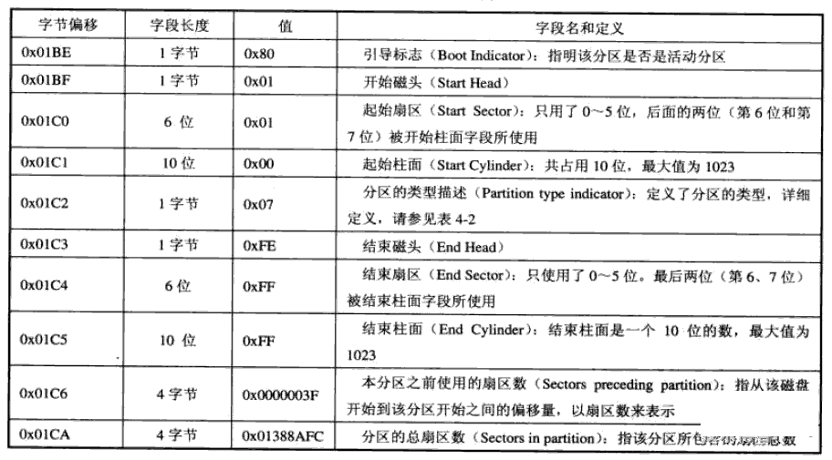

>**[官网](https://linux.vbird.org/)**
# 第零章、计算机概论
## 计算机
### CPU 的架构
目前世界上常见到的两种主要 CPU 架构，分别是：精简指令集（RISC）与复杂指令集（CISC）系统。
- Reduced Instruction Set Computer
>微指令集较为精简，每个指令的运行时间都很短，完成的动作也很单纯，指令的执行效能较佳；但是若要做复杂的事情，就要由多个指令来完成。常见的 RISC 微指令集 CPU 主要有例如甲骨文公司的 SPARC 系列、IBM 公司的 Power Architecture（包括 PowerPC）系列、与安谋公司（ARM Holding）的 ARM CPU 系列等。
>
>在应用方面，SPARC CPU 的计算机常用于学术领域的大型工作站中，包括银行金融体系的主服务器也都有这类的计算机架构：至于 PowerPC 架构的应用上，例如新力（Sony）公司出产的 PS3 就是使用 PowerPC 架构的 Cell 处理器；那安谋的 ARM 呢？你常使用的各厂牌手机、PDA、导航系统、网络设备（交换器、路由器等）等，几乎都是使用 ARM 架构的 CPU！
- Complex Instruction Set Computer
>CISC在微指令集的每个小指令可以执行一些较低阶的硬件操作，指令数目多而且复杂，每条指令的长度并不相同。因为指令执行较为复杂所以每条指令花费的时间较长，但每条个别指令可以处理的工作较为丰富。常见的 CISC 微指令集 CPU 主要有 AMD、Intel、VIA 等的 x86 架构的 CPU。
>
>由于 AMD、Intel、VIA 所开发出来的 x86  架构 CPU 被大量使用于个人计算机用途上面，因此，个人计算机常被称为 x86 架构的计算机。

### 计算机上面常用的计算单位
一般来说，文件容量使用的是二进制的方式，所以 1GBytes 的文件大小实际上为：1024\*1024\*1024 Byte 这么大！速度单位则常使用十进制，例如 1GHz 就是 1000\*1000\*1000 Hz 的意思。

**Mbps：Mbits per second**

硬盘的最小物理量为 512 Bytes，最小的组成单位为扇区（sector），通常硬盘容量的计算采用【多少个sector】，所以才会使用十进制来处理。
## 个人计算机架构与相关设备组件
早期的芯片组通常分为两个网桥来控制各组件的沟通，分别是：
1. 北桥：
>负责链接速度较快的 CPU、主存与显示适配器界面等组件
2. 南桥：
>负责连接速度较慢的装置接口，包括硬盘、USB、网络卡等等。

**目前的主流架构中，大多将北桥内存控制器整合到 CPU 封装当中了。**

### CPU
在早期的 CPU 设计中，所谓的**外频**指的是 CPU 与外部组件进行数据传输时的速度，**倍频**则是 CPU 内部用来加速工作效能的一个倍数，两者相乘才是 CPU 的频率速度。

**超线程**：在每一个 CPU 内部将重要的寄存器分成两群，而让程序分别使用这两群寄存器。也就是说，可以有两个程序【同时竞争 CPU 的运算单元】，而非透过操作系统的多任务切换！这一过程就会让 CPU 好像【同时有两个核心】的模样！

### 内存
**多通道设计**：由于所有的数据都必须要存放在主存中，所以主存的数据宽度当然是越大越好。但传统的总线宽度一般大约仅达64位，为了要加大这个宽度，因此芯片组厂商就将两个主存汇整在一起，如果一支内存可达64位，两支内存就可以达到128位了，这就是双通道的设计理念。

**主存**：DRAM

**L2 cache（第二层快取）**：SRAM

### 硬盘与储存设备
### 主板
CMOS 主要的功能为记录主板上面的重要参数，包括系统时间、CPU 电压与频率、各项设备的 I/O 地址与 IRQ 等，由于这些数据的记录要花费电力，因此主板上面才有电池。 BIOS 为写入到主板上某一块 flash 或 EEPROM 的程序（韧体），他可以在开机的时候执行，以加载 CMOS 当中的参数，并尝试呼叫储存装置中的开机程序，进一步进入操作系统当中。 BIOS 程序也可以修改 CMOS 中的数据，每种主板呼叫 BIOS 设定程序的按键都不同，一般桌面计算机常见的是使用【del】按键进入 BIOS 设定画面。

## 数据表示方式
## 软件程序运作
### 操作系统
操作系统这组程序的重点在于管理计算机的所有活动以及驱动系统中的所有硬件。

## Practice
- 如果使用的是 Windows 操作系统，可使用 [CPU-Z](https://www.cpuid.com/softwares/cpu-z.html)
- 如果使用的是 Linux 操作系统，可使用`cat /proc/cpuinfo` 以及 `lspci`。

# 第一章、Linux 是什么与如何学习
# 第二章、主机划分与磁盘分区
## 磁盘分区
### MSDOS(MBR) 与 GPT 磁盘分区表(partition table)
- MSDOS(MBR)
早期的 LInux 系统为了兼容于 Windows 的磁盘，因此使用的是支持 Windows 的 MBR(Master Boot Record)的方式来处理开机管理程序与分区表！而开机管理程序记录区域分区表则通通放在磁盘的第一个扇区，这个扇区通常是 512bytes 的大小，所以说，第一个扇区 512bytes 会有这三个数据：
	* MBR：可以安装开机管理程序的地方，有 446 bytes
	* partition table：记录整颗磁盘分区的状态，有 64 bytes
		> 由于分区表所在区块仅有 64 bytes 容量，因此最多仅能有四组记录区，每组记录区记录了该区段的起始于结束的磁柱号码（**每个分区表项占16个字节**）。
		> 分区槽的最小单位【通常】为磁柱（cylinder）
		> 主要分区与延伸分区最多可以有四笔（硬盘的限制）
		> 延伸分区最多只能有一个（操作系统的限制）
		> 逻辑分区是由延伸分区持续切割出来的分区槽
		> 能够被格式化后，作为数据存取的分区槽为主要分区与逻辑分区。延伸分区无法格式化
	* MBR 结束标志：占MBR扇区最后2个字节，一直为 “55 AA"

>**如果磁盘容量大于 2TB 以上时，系统会自动使用 GPT 分区方式来处理磁盘分区。**
- GPT
为了兼容于所有的磁盘，因此在扇区的定义上面，大多会使用所谓的逻辑区块地址（Logical Block Address，LBA）来处理。GPT 将磁盘所有区块以此 LBA（预设为 512bytes）来规划，而第一个 LBA 称为 LBA0。GPT 使用了 34 个 LBA 区块来记录分区信息！并且整个磁盘的最后 33 个 LBA 也拿来作为另一个备份！
	- LBA0（MBR 相容区块）
		> 与 MBR 模式相似的，这个兼容区块也分为两个部分，一个就是跟之前 446bytes 相似的区块，储存了第一阶段的开机管理程序！而在原本的分区表的记录区内，这个兼容模式仅放入一个特殊标志的分区，用来表示此磁盘为 GPT 格式之意。而不懂 GPT 分区表的磁盘管理程序，就不会认识这颗磁盘，除非用户有特别要求要处理这颗磁盘，否则该管理软件不能修改此分区信息，进一步保护了此磁盘。
	- LBA1（GPT 表头记录）
	- LBA2-33（实际记录分区信息处）
		> 从 LBA2 区块开始，每个 LBA 都可以记录 4 笔分区记录，所以在默认的情况下，总共可以有 4\*32 = 128 笔分区记录
		
### 开机流程中的 BIOS 与 UEFI 开机检测程序
基本上，目前的主机系统在加载硬件驱动方面的程序，主要有早期的 BIOS 与新的 UEFI 两种机制。
- BIOS 搭配 MBR/GPT 的开机流程
BIOS 是在开机时计算机系统会主动执行的第一个程序。接下来BIOS会去分析计算机里面有哪些储存设备，我们以硬盘为例，BIOS 会依据使用者的设定去取得能够开机的硬盘，并且到该硬盘里面去读取第一个扇区的 MBR 位置。MBR 这个仅有 446bytes 的硬盘容量里面会放置最基本的开机管理程序，接下来就是 MBR 内的开机管理程序的工作了。
这个开机管理程序的目的是在加载器核心文件，由于开机管理程序是操作系统在安装的时候所提供的，所以它会认识硬盘内的文件系统格式，因此就能够读取核心文件，然后接下来就是核心文件的工作，再之后的工作就交给操作系统了。
开机管理程序除了可以安装在 MBR 之外，还可以安装在每个分区槽的启动扇区（boot sector）
	* 每个分区槽都拥有自己的启动扇区（boot sector）
	* 实际可开机的核心文件是放置到各分区槽内的！
	* loader 只会认识自己的系统槽内的可开机核心文件，以及其他 loader 而已
	* loader 可直接指向或者是间接将管理权转交给另一个管理程序。、
>Windows 在安装的时候，它的安装程序会主动的覆盖掉 MBR 以及自己所在分区槽的启动扇区，你没有选择的机会。
- UEFI BIOS 搭配 GPT 的开机流程
UEFI 主要是想要取代 BIOS 这个韧体界面，因此我们也称它为 UEFI BIOS。UEFI 使用 C 语言开发。
### Linux 安装模式下，磁盘分区的选择
- 文件系统与目录树的关系
所谓的挂载就是利用一个目录当成进入点，将磁盘分区槽的数据放置在该目录下。也就是说，进入该目录就可以读取该分区槽的意思。这个动作我们称为**挂载**，那个进入点的目录我们称为**挂载点**。
## 安装 Linux 前的规划
### 主机的服务规划与硬件的关系
- 打造 Windows 与 Linux 共存的环境

# 第三章、安装 CentOS7.x
## 开始安装 CentOS 7
### 磁盘分区与文件系统设定
文件系统
- ext2/ext3/ext4：Linux 早期适用的文件系统类型。
- swap：磁盘仿真成内存
- BIOS Boot
- xfs：目前 CentOS 预设的文件系统，最早是由大型服务器所开发出来的！它对于大容量的磁盘管理非常好，而且格式化的时候速度相当快。
- vfat：同时被 Linux 与 Windows 所支持的文件系统类型。

# 第四章、首次登入与在线求助
## 首次登入系统
### X window 与文本模式的切换
通常我们称文本模式为终端机接口，terminal 或 console。Linux 预设的情况下会提供六个 Terminal 来让使用者登入，切换的方式为：`Ctrl + Alt + F1~F6` 的组合按钮
>如果默认是启动图形界面的，这个 X 窗口将会出现在 tty1 界面中。如果你的 Linux 预设使用纯文本界面，那么 tty1~tty6 就会被文字界面占用。
>
>在 CentOS  7 环境下，当开机完成之后，默认系统只会提供给你一个 tty 而已，因此无论是文字界面还是图形界面，都是会出现在 tty1 。tty2~tty6 其实一开始是不存在的，但是当你要切换时，系统才产生出额外的 tty2，tty3...

可以使用 `startx` 命令在终端启动个人的图形界面。但有如下限制：
- 并没有其他的 X windows 被启用
- 你必须已经安装了 X Window system，并且 X server 是能够顺序启动的。
- 你最好要有窗口管理员
>其实，所谓的窗口环境就是 **文字界面加上X窗口软件** 的组合

## 文本模式下指令的下达
### 开始下达指令
**语系支持**：`locale`

### 基础指令的操作
- date
- cal
- bc
### 重要的几个热键
- `ctrl + D`：键盘输入结束（EOF）/ 取代 `exit` 命令
- `shift + PageUp/PageDown`：翻页

## man page 和 info page
### --help
### man page
**手册类别代号**：

| 代号 | 代表内容 |
| --- | ----------- |
| 1 | 用户在 shell 环境中可以操作的指令或可执行文件 【Executable programs or shell commands】 |
| 2 | 系统核心可呼叫的函数与工具等 【System calls (functions provided by the kernel)】|
|3 | 一些常用的函数与函数库（library），大部分为 C 的函数库（lib） 【Library calls (functions within program libraries)】|
| 4 | 装置文件的说明，通常在 /dev 下的文件 【Special files (usually found in /dev)】
| 5 | 配置文件或者是某些文件的格式 【File formats and conventions, e.g. /etc/passwd】|
| 6 | 游戏 【games】 |
| 7 | 惯例与协议等，例如 Linux 文件系统、网络协议、ASCII code 等等的说明 【Miscellaneous (including macro packages and conventions), e.g. man(7), groff(7)|
| 8 | 系统管理员可用的管理指令 【System administration commands (usually only for root)】|
| 9 | 跟 kernel 有关的文件 【Kernel routines [Non standard]】|

| 代号 | 内容说明 |
| --- | ----------- |
| name | 简短的指令、数据名称说明 |
| synopsis | 简短的指令下达语法简介 |
|description | 较为完整的说明 |
| options | 针对 synopsis 部分中，有列举的所有可用的选项说明 |
| commands | 当这个程序（软件）在执行的时候，可以在此程序（软件）中下达的指令 |
| files | 这个程序或数据所使用或参考或链接到的某些文件 |
| see also | 可以参考的，跟这个指令或数据有相关的其他说明 |
| example | 一些可以参考的范例 |

**快捷键**：

| 按键 | 行为 |
| ---- | ----|
| 空格 | 向下滚动一行
| PageUp/PageDown | 翻页 |
| home | 去到第一页 |
| end | 去到最后一页 |
| /keyword | 向**下**搜寻 **keyword**
| ?keyword | 向**上**搜寻 **keyword**
| n, N | 可以用 n 来继续下一个搜寻，可以利用 N 来进行反向搜寻。
| q | 退出 man page |

**相关命令**：
- `whatis`
- `apropos`
- `mandb`：建立 `wahtis` 数据库

### info page
- H
info page 是只有 Linux 上面才有的产物，而且易读性增强很多。不够查询的指令说明要具有 info page 功能的话，得用 info page 的格式来写成在线求助文件才行。**至于非以 info page 格式写成的说明文件，虽然也能够使用 info 来显示，不过其结果就会跟 man 相同。**

### 其他有用的文件（documents）
- /usr/share/doc/

## nano

## 正确的关机方法
- 数据同步写入磁盘：
>`sync`
>目前的 `shutdown/reboot/halt` 等指令均已经在关机前进行了 sync 这个工具的呼叫。
>一般账号用户所更新的磁盘数据仅有自己的数据，而 root 可以更新整个系统中的数据。
- 观察系统的使用状态：
>`who`、`netstat -a`
- 通知在线使用者关机的时刻：
>`shutdown`
- 正确的关机指令：
>`reboot`、`halt`、`poweroff`
>`systemctl reboot/halt/poweroff`

# 第五章、Linux 的文件权限与目录配置
## Linux 文件权限概念
### 如何改变文件属性与权限
- 改变所属群组
>`chgrp`
- 改变文件拥有者（也可以修改群组）
>`chown`
- 改变权限
>`chmod`

### Linux 文件种类与扩展名
**Linux 文件名长度限制**：
>在 Linux 底下，使用传统的 Ex2/Ex3/Ex4 文件系统以及近来被 CentOS 7 当做预设文件系统的 xfs 而言，针对文件名的长度限制为：**单一文件或目录的最大容许文件名长度为255bytes。**

## Linux 目录配置
### Linux 目录配置的依据——FHS

# 第六章、Linux 文件与目录管理
## 文件与目录管理
### 取得路径的文件名与目录名称
- `basename`
- `dirname`

## 文件内容查阅
### 直接检视文件内容
- `cat`
- `tac`
- `nl`

### 可翻页检视
- `more`
- `less`

### 资料撷取
- `head`
- `tail`

### 非纯文本档
- `od`

### 修改文件事件或建制新档：
**时间参数：**
- modication time (mtime)：modify content
- status time(ctime)：status change
- access time(atime)：access/read
>默认情况下，ls 显示出来的是该文件的 mtime 。

**`touch`**：
- 建立一个空的文件
- 将某个文件日期修订为目前（`mtime:-m` 与 `atime:-a`）

## 文件与目录的默认权限与隐藏权限
- 文件默认 666
- 目录默认 777
### umask
- 实际权限：`默认权限 - umask`
- `umask -S`

### 文件隐藏属性
>chattr 只能在 ext2/ext3/ext4 的 Linux 传统文件系统上面完整生效。

- `chattr`
	* `+i`
	* `-i`
- `lsattr`

### 文件特殊权限
- set UID
>当 s 这个标志出现在文件拥有者的 x 权限上时，此时就被称为 set UID ，简称为 SUID 的特殊权限。
	* SUID 权限仅对二进制程序有效
	* 执行者对于该程序需要具有 x 的可执行权限
	* 执行者将具有该程序拥有者的权限，本权限仅在执行该程序的过程中有效
>比如 `passwd`
- set GID
>当 s 标志在文件拥有者的 x 项目为 SUID，那 s 在群组的 x 时则称为 set GID，简称为 SGID。
>对文件：
>	* SGID 对二进制程序有用
>	* 程序执行者对于该程序来说，需具备 x 的权限
>	* 执行者在执行的过程中将会获得该程序群组的支持！
>对目录：
>	* 用户若对于此目录具有 r 与 x 的权限时，该用户能够进入此目录
>	* 用户在此目录下的有效群组将会变成该目录的群组
>	* 若用户在此目录下具有 w 的权限，则使用者所建立的新文件，该新文件的群组与此目录的群组相同
- sticky bit（t）
>仅针对目录有效
	* 当用户对于此目录具有 w，x 权限时
	* 当用户在该目录下建立文件或目录时，仅有自己与 root 才有权利删除该文件。

- suid/sgid/sbit 权限设定
	* 4 为 suid
	* 2 为 sgid
	* 1 为 sbit
>**其中大写的 S 表示有 s 但没有 x ，大写的 T 同理。**

### 观察文件类型
- `file`

## 指令与文件的搜寻
### 脚本文件名的搜寻
- `which`
- `type`

### 文件档名的搜寻
- `whereis`
>仅搜寻特定目录
- `locate`
>获取最新数据需使用 `updatedb` 指令更新数据库。
- `find`

# 第七章、Linux 磁盘与文件系统管理
## 认识 Linux 文件系统
### 文件系统特性
磁盘分区完毕后还需要进行格式化（format），之后操作系统才能够使用这个文件系统。
因为每种操作系统所设定的文件属性/权限并不相同，为了存放这些文件所需的数据，因此就需要将分区槽进行格式化，以成为操作系统能够利用的【文件系统格式（filesystem）】。
传统的磁盘与文件系统应用中，一个分区槽就是只能够被格式化成为一个文件系统，所以我们可以说一个 filesystem 就是一个 partition 。但是由于新技术的利用，例如我们常听到的 LVM 与软件磁盘阵列（software raid），这些技术可以将一个分区槽格式化为多个文件系统，也能够将多个分区槽合成一个文件系统！所以我们现在通常称呼一个可被挂载的数据为一个文件系统而不是一个分区槽。

文件系统中除了文件实际内容外，通常还含有许多属性。文件系统通常会将这两部分的数据分别存放在不同的区块，权限与属性放置到 inode 中，至于实际数据则放置到 data block 区块中。另外，还有一个超级区块（superblock）会记录整个文件系统的整体信息，包括 inode 与 block 的总量、使用量、剩余量等。
每个 inode 与 block 都有编号，而每个文件都会占用一个 inode ， inode 内则有文件数据放置的 block 号码。

### Linux 的 EXT2 文件系统
Ext2 文件系统在格式化的时候基本上是区分为多个区块群组的，每个区块群组都有独立的 inode/block/superblock 系统。
在整体的规划当中，文件系统最前面有一个启动扇区（boot sector），这个启动扇区可以安装开机管理程序。
其中每个区块群组（block group）又分为六个主要内容：
- data block
>每个 block 内最多只能够放置一个文件的数据
- inode table
	**记录内容**：
	* 该文件的存取方式
	* 该文件的拥有者与群组
	* 该文件的容量
	* 该文件建立或状态改变的时间（ctime）
	* 最近一次的读取时间（atime）
	* 最近修改的时间
	* 定义文件特性的旗标，如 Set UID
	* 该文件真正内容的指向（pointer）
	**特色**：
	- 每个 inode 大小均固定为 128 bytes（新的 ext4 与 xfs 可设定到 256 bytes）
	- 每个文件都仅会占用一个 inode 而已
	- 系统读取文件时需要先找到 inode ，并分析 inode 所记录的权限与用户是否符合，若符合才能够开始实际读取 block 的内容
* superblock
	* block 与 inode 的总量
	* 未使用与已使用的 inode/block 数量
	* block 与 inode 的大小
	* filesystem 的挂在时间、最近一次写入数据的时间、最近一次检验磁盘的时间等文件系统的相关信息
	* 一个 valid bit 数值，若此文件系统已被挂载，则 valid bit 为0，否则为1
>每个 block group 都可能含有 superblock

- Filesystem Description
这个区段可以描述每个 block group 的开始与结束的 block 号码，以及说明每个区段分别介于哪些 block 号码之间。
- block bitmap
从 block bitmap 当中可以知道哪些 block 是空的。
- inode bitmap

- **dumpe2fs**
查询 Ext 家族 superblock 信息
>`blkid`

### 与目录树的关系
- 目录
当我们在 Linux 下的文件系统建立一个目录时，文件系统会分配一个 inode 与至少一块 block 给该目录。其中，inode 记录该目录的相关权限与属性，并可记录分配到的那块 block 号码；而 block 而是记录在这个目录下的文件名与该文件名占用的 inode 号码数据。
- 文件
- 目录树读取
inode 本身并不记录文件名，文件名的记录是在目录的 block 当中。

由于目录树是由根目录开始读起，因此系统透过挂载的信息可以找到挂载点的 inode 号码，此时就能够得到根目录的 inode 内容，并依据该 inode 读取根目录的 block 内的文件名数据，再一层一层的往下读到正确的档名。

- filesystem 大小与磁盘读取效能

### Ext2/Ext3/Ext4 文件的存取与日志式文件系统的功能
一般来说，我们将 inode table 与 data block 称为数据存放区域，至于其他例如 superblock、block bitmap、inode bitmap 等区段就被称为 metadata（中介资料）

- 数据的不一致（Inconsistent）状态
- 日志式文件系统（Journaling filesystem）

### Linux 文件系统的运作
### 挂载点的意义（mount point）
每个 filesystem 都有独立的 inode/block/superblock 等信息，这个文件系统要能够链接到目录树才能被我们使用。将文件系统与目录树结合的动作我们称为 【挂载】。

### 其他 Linux 支持的文件系统与 VFS
查看支持的文件系统：
`ls -l /lib/modules/$(uname -r)/kernel/fs`
查看目前已加载到内存中支持的文件系统：
`cat /proc/filesystems`

**Linux VFS(Virtual Filesystem Switch)**:
整个 Linux 的系统都是透过一个名为 Virtual Filesystem Switch 的核心功能去读取 filesystem 的。也就是说，整个 Linux 认识的 filesystem 其实都是 VFS 在进行管理，我们使用者并不需要知道每个 partition 上头的 filesystem 是什么，VFS 会主动的帮我们做好读取的动作。

### XFS 文件系统简介
- ext 家族缺点：支持度最广，但格式化超慢
- xfs 文件系统：
	- 资料区（data section）
	- 登录区（log section）
		记录文件系统的变化（日志）
	- 实时运作区（realtime section）
		当有文件要被建立时，xfs 会在这个区段里面找一个到数个的 extent 区块，将文件放置在这个区块内，等到分配完毕后，再写入到 data section 的 inode 与 block 去。
- XFS 文件系统的描述数据观察
>`xfs_info`

## 文件系统的简单操作
### 7.2.1 磁盘与目录的容量
- df：列出文件系统的整体磁盘使用量
- du：评估文件系统的磁盘使用量

### 7.2.2 实体链接与符号链接
- **Hard Link**：ln
>hard link 只是在某个目录下新增一笔档名链接到某 inode 号码的关联记录。
>限制：
>	- 不能跨 Filesystem
>	- 不能 link 目录 （**原因应该是安全性不能再被保证**）
- **Symbolic Link**：ln -s

## 磁盘的分区、格式化、检验与挂载
### 观察磁盘分区状态
- lsblk（list block device）
- blkid
- parted（也能用于磁盘分区）

### 磁盘分区
- gdisk(GPT)
- fdisk(MBR)
- partprobe：更新 Linux 核心的分区表信息

### 磁盘格式化
make filesystem —— mkfs
- mkfs.xfs
- mkfs.ext4
>`dumpe2fs`
- mkfs
>mkfs -t [fs]

### 文件系统检验
- xfs_repair
- fsck.ext4

### 文件系统挂载与卸除
- mount
- umount

### 磁盘/文件系统参数修订
- mknod
- xfs_admin
>uuidgen
- tune2fs

## 设定开机挂载
### 开机挂载 /etc/fstab 及 /etc/mtab
### 特殊装置 loop 挂载
```
THE LOOP DEVICE
       One further possible type is a mount via the loop device. For example, the command

              mount /tmp/disk.img /mnt -t vfat -o loop=/dev/loop

       will set up the loop device /dev/loop3 to correspond to the file /tmp/disk.img, and then mount this device on /mnt.
```

## 内存置换空间（swap）之建置
### 使用实体分区槽建置 swap
1. 分区
2. 开始建置 swap 格式(格式化)
>`mkswap /dev/*`
3. 加载与观察
	- `swapon/swapoff`：使用/关闭用于分页和交换的文件和设备
	- `free`

### 使用文件建置 swap
1. 使用 dd 这个指令来新增一个大文件
2. 使用 mkswap 格式化文件
3. 使用 swapon 启动交换空间

## 文件系统的特殊观察与操作

# 第八章、文件与文件系统的压缩、打包与备份
## Linux 系统常见的压缩指令
### gzip/gunzip, zcat/zmore/zless/zgrep
### bzip2, bzcat/bzmore/bzless/bzgrep
### xz, xzcat/xzmore/xzless/xzgrep

## 打包指令
### tar

## XFS 文件系统的备份与还原
### xfs 文件系统备份
- xfsdump
### xfs 文件系统还原
- xfsrestore

## 光盘写入工具
### 建立映像档
- mkisofs
>isoinfo

### 光盘刻录工具
- wodim
- cdrecord

## 其他常见的压缩与备份工具
### dd
>xfs_growfs

### cpio

# 第九章、vim 程序编辑器
# 第十章、认识与学习 BASH
只要能够操作应用程序的接口都能够称为壳程序

## Shell 的变量功能
### read, array, declare
- read
- declare/typeset
	* 变量类型默认为 字符串
	* bash 环境中的数值运算，预设最多仅能到达整数
- array
	`var[index]=content`
	`echo ${var[index]}`

### ulimit

### 变量内容的删除、取代与替换
- 变量内容的删除与取代 
| 变量设定方式 | 说明 |
| --------------  | ----- |
| ${变量#关键词} | 若变量内容从头开始的数据符合“关键词”，则将符合的最短数据删除 |
|  ${变量##关键词} | 若变量内容从头开始的数据符合“关键词”，则将符合的最长数据删除 |
|  ${变量%关键词} | 若变量内容从尾向前的数据符合“关键词”，则将符合的最短数据删除 |
|  ${变量%\%关键词} | 若变量内容从尾向前的数据符合“关键词”，则将符合的最长数据删除 |
|  ${变量/旧字符串/新字符串} | 若变量内容符合“旧字符串”，则第一个旧字符串会被新字符串取代 |
|  ${变量//旧字符串/新字符串} | 若变量内容符合“旧字符串”，则全部的旧字符串会被新字符串取代 |

- 变量的测试与内容替换
| 变量设定方式 | str 没有设定 | str 为空字符串 | str 已设定非空字符串 |
| --------------- | ------------- | ----------------  | -----------------------  |
| var=${str-expr} | var=expr| var= | var=\${str} |
| var=${str:-expr} | var=expr| var=expr | var=\${str} |
| var=${str+expr} | var=| var=expr | var=expr |
| var=${str:+expr} | var=| var= | var=expr |
| var=${str=expr} | str=expr; var=expr| str 不变; var= | str 不变; var=\$str |
| var=${str:=expr} | str=expr; var=expr| str=expr; var=expr | str 不变; var=\$str |
| var=${str?expr} | expr 输出至 stderr | var= | var=\$str |
| var=${str:?expr} | expr 输出至 stderr | expr 输出至 stderr | var=\$str |

## 命令别名与历史命令
### alias, unalias

### history
- `!number`
- `!command`：由最近的指令向前搜寻【指令串开头以 command】的那个指令并执行
- `!!`

## Bash Shell 的操作环境
### 路径与指令搜寻顺序(type -a command)
1. 以相对路径/绝对路径执行指令
2. 由 alias 找到该指令来执行
3. 由 bash 内置指令来执行
4. 透过 $PATH 这个变量的顺序搜寻到的第一个指令来执行

### bash 的进站与欢迎讯息
- `/etc/issue`
- `/etc/motd`

### bash 的环境配置文件
- `/etc/profile`（login shell 才会读）
- `~/.bash_profile`（login shell 才会读）
- `~/bashrc`（non-login shell 会读）
- `/etc/man_db.conf`

### 终端机的环境设定
- stty（set tty）
- set
>`echo $-` ：显示目前所有的 set 设定值

## 数据流重导向
流的合并应写在命令末尾。
1. stdin: < / << + "end character"
2. stdout: > / >>
3. stderr: 2 > /2>>
4. 2>&1 / &> ：将 stderr 合并到 stdout
5. 1>&2
6. /dev/null

### 命令执行的判断依据
命令执行顺序自左往右，无优先级考虑
命令执行判断依据为 `$?`
- ;
- &&
- ||

## pipe
对于 `stderr` 没有直接处理的能力。

### 撷取命令
- cut
- grep

## 排序命令
- sort
- wc
- uniq

### 双向重导向
- tee

### 字符转换命令
- tr
- col
- join
- paste
- expand
>`unexpand`

### 分区命令
- split

### 参数代换
- xargs
弥补某些命令不支持管线（即不支持从 stdin 读取输入）
将从标准输入得到的数据经过处理后作为“后续命令参数”（如 ls -l）的参数。

### 关于减号 - 的用途
某些指令需要用到文件名（例如 tar）来进行处理时，该 stdin 与 stdout 可以利用减号“-”来替代，举例来说
```shell
mkdir /tmp/homeback
# 将 /home 里面的文件给它打包，但打包的数据不是记录到文件，而是传送到 stdout；经过管线后，将 tar -cvf - /home 传送给后面的 tar -xvf -
tar -cvf - /home | tar -xvf - -C /tmp/homeback
```

# 第十一章、正规表示法与文件格式化处理
## 文件的格式化与相关处理
### printf
### awk
### diff（比较文件或目录（单位行））
- `cmp`（比较文件（单位字节））
- `patch`：配合 diff 命令使用食用效果极佳

### pr

## 第十二章、学习 Shell Scripts
## 简单的 shell script 练习
### script 的执行方式差异
- ./script
>script 实质上是在子程序的 bash 中执行。

- 利用 source 来执行脚本
>脚本执行的环境为当前 shell

## 善用判断式
### test
### Shell script 的默认变量
- $0：脚本名
- $1：第一个参数
- $#：代表参数个数
- $@：代表【"$1", "$2", "$3", "$4"】
- $\*：代表【"$1 $2 $3 $4"】

- `shift`

## 条件判断式
### if...then
```shell
if [ 条件判断式1 ] || [ 条件判断式2 ]; then
	statement1;
elif [ 条件判断式3 -a 条件判断式4 ]; then
	statement2;
else 
	statement3;
fi
```

### case...esac
```shell
case ${变量名称} in
	"第一个变量内容")
		statement;
		;;
	"第二个变量内容")
		statement;
		;;
	*)
		statement;
		exit 1;
		;;
esac
```

### function
函数必须先定义再使用
```shell
function name() {
	statement;
}
```

## 循环
### while do done, until do done
```shell
while [ condition ]
do 
	statement;
done
```
### until do done
```shell
until [ condition ]
do 
	statement
done
```

### for do done（v1）
```shell
for var in condition1 condition2 condition3
do 
	statement
done
```
配合 `seq/{begin...end}` 食用效果更佳

### for do done（v2）
```shell
for (( 初始值; 限制值; 执行步阶))
do 
	statement
done
```

## shell script 的追踪与 debug
- `-n`：查询语法问题
- `-x`：将使用到的 script 内容显示到屏幕上
```shell
sh -n script
sh -x script
bash -c "cmd"   # 从字符串中读入命令
```

# 第十三章、Linux 账号管理与 ACL 权限设定
## Linux 的账号与群组
### 使用者标识符
- `UID`
>`/etc/passwd`
- `GID`
>`/etc/group`

### 使用者账号
- `/etc/passwd`
	* 账号名称
	* 密码
	* UID
	* GID
	* 用户信息说明栏
	* 家目录
	* shell
* `/etc/shadow`
	* 账号名称
	* 密码
	* 最近更改密码的日期
	* 密码不可被更改的天数
	* 密码需要重新变更的天数
	* 密码需要变更期限前的警告天数
	* 密码过期后的账号宽限时间（密码失效日）
	* 账号失效日期
	* 保留
>查询加密算法：`authconfig --test | grep hashing`

### 关于群组
- `/etc/group`
	1. 组名
	2. 群组密码
	3. GID
	4. 此群组支持的账号名称

- 初始群组
>`/etc/passwd` 中的 `GID`
- 有效群组
>执行 `groups` 命令后得到的第一个答案
- `newgrp`
>切换有效群组（仅允许在支持的群组中进行切换）
>并且只是暂时切换（可以理解为新开一个 shell 然后在其中改变 有效群组。）
- `/etc/gshadow`
	1. 组名
	2. 密码栏；开头为 ！表示无合法密码，所以无群组管理员
	3. 群组管理员的账号
	4. 此群组支持的账号名称

## 账号管理
### 用户操作
- 参考文件
>`useradd -D` 即 `/etc/default/useradd`
>`/etc/login.defs`
- `passwd`
- `chage`
- `usermod`
- `userdel`

### 用户功能
- `id`
- `finger`
- `chfn`
- `chsh`

### 新增与移除群组
- `groupadd`
- `groupmod`
- `groupdel`
>保证待删除的群组没有用户将其作为 **initial group**
- `gpasswd`

### 使用外部身份认证系统

## ACL 的使用
### 什么是 ACL
ACL 是 Access Control List 的缩写，主要的目的是在提供传统的 owner，group，others 的 read，write，execute 权限之外的细部权限设定。
ACL 可以针对单一使用者，单一文件或目录来进行 r，w，x 的权限规范，对于需要特殊权限的使用状况非常有帮助。
主要可针对以下项目：
- user
- group
- 默认属性（mask）：最大开放权限

### 如何支持启动 ACL
- 检查
`dmesg | grep -i acl`

### ACL 的设定技巧
- `getfacl`
- `setfacl`

## 使用者身份切换
### su
单纯使用 su 切换成为 root 的身份，读取的变量设定方式 为 non-login shell 的方式，这种方式很多原本的变量不会被改变，由于没有改变成为 root 的环境，因此很多 root 惯用的指令就只能使用绝对路径来执行。
- 若要完整的切换到新使用者的环境，必须要使用 `su - username` 或 `su -l username`，才会连同 PATH/USER/MAIL 等变量都转成新用户的变量
- 如果仅想要执行一次 root 指令，可以利用 `su - -c "command"` 的方式来处理
- 使用 root 切换成为任何使用者时，并不需要输入该用户的密码

### sudo
相对于 su 需要知道新切换的用户密码，sudo 的执行则仅需要自己的密码即可！甚至可以设定不需要密码即可执行 sudo 。由于 sudo 可以让你以其他用户的身份执行指令（通常是使用 root 的身份来执行指令），因此并非所有人都能够执行 sudo，而是仅有规范到 `/etc/sudoers` 内的用户才能够执行 sudo 这个指令。

- sudo 的指令用法
	* `-u user`
	sudo 的执行流程：
	1. 当用户执行 sudo 时，系统于 /etc/sudoers 文件中搜寻该使用者是否有执行 sudo 的权限
	2. 若使用者具有权限后，便让使用者输入用户自己的密码来确认
	3. 当密码输入成功，便开始进行 sudo 后续接的指令
	4. 若欲切换的身份与执行者身份相同，那也不需要输入密码
- `visudo` 与 `/etc/sudoers`
| 使用者账号 | 登入者的来源主机名=(可切换的身份) | 可下达的指令 |
| ------------  | -------------------------------------------- | --------------- |

## 用户的特殊 shell 与 PAM 模块
### /sbin/nologin
可以建立 `/etc/nologin.txt` 这个文件，并且在这个文件内说明不能登入的原因，那么下次当这个用户想要登入系统时，屏幕上出现的就会是 `/etc/nologin.txt` 这个文件的内容！

### PAM 模块简介
PAM 可以说是一套应用程序编程接口，它提供了一连串的验证机制，只要使用者将验证阶段的需求告知 PAM 后，PAM 就能够汇报使用者验证的结果。
PAM 用来进行验证的数据称为模块（Modules），每个 PAM 模块的功能都不太相同。

| 验证类别 | control flag | PAM 模块与该模块的参数 |
| ---------- | ---------- |----------------------------- |
| auth | required | |
| account | requisite | |
| session | sufficient | |
| password | optional | |

### 常用模块简介
- `pam_securetty.so`
- `pam_nologin.so`
- `pam_selinux.so`
- `pam_console.so`
- `pam_loginuid.so`
- `pam_env.so`
- `pam_unix.so`
- `pam_pwquality.so`
- `pam_limits.so`

### 其他相关文件
dir：/etc/security
- `limits.conf`
- `var/log/secure`
- `var/log/message`

## Linux 主机上的用户讯息传递
### 查询使用者
- `id`
- `finger`
- `last`
- `w`
- `who`
- `lastlog`

### 使用者对谈
- `write`
- `mesg`
- `wall`

### 使用者邮件信箱
- `mail`

## CentOS 7 环境下大量建置账号的方法
### 账号相关的检查工具
- `pwck`
- `grpck`
- `pwconv`
- `chpasswd`

### 大量建置账号脚本模板

# 第十四章、磁盘配额（Quota）与进阶文件系统管理
## 磁盘配额（Quota）的应用与实作
### 什么是 Quota
- 限制某一群组所能使用的最大磁盘配额（使用群组限制）gquota/grpquota
- 限制某一用户的最大磁盘配额（使用用户限制）uquota/usrquota/quota
- 限制某一目录的最大磁盘配额 pquota/prjquota

使用限制：
- 在 EXT 文件系统家族仅能针对整个 filesystem 而不是某一目录
- 核心必须支持 quota
- 只对一般身份使用者有效
- 若启用 SELinux，非所有目录均可设定 quota

### 一个 XFS 文件系统的 Quota 实作范例
**`xfs_quota`**

## 软件磁盘阵列（Software RAID）
### 什么是 RAID
磁盘阵列全名是：Redundant Arrays of Inexpensive Disks。RAID 可以透过一个技术（软件或硬件），将多个较小的磁盘整合成为一个较大的磁盘装置；而这个较大的磁盘功能不止是储存而已，它还具有数据保护的功能。整个 RAID 由于选择的等级不同，而使得整合后的磁盘具有不同的功能，基本常见的 level 有这几种：
- RAID-0（等量模式）：效能最佳
- RAID-1（映像模式）：完整备份
- RAID 1+0/RAID 0+1
- RAID 5：效能与数据备份的均衡考虑
- Spare Disk：预备磁盘的功能

磁盘阵列的优点：
- 数据安全与可靠性
- 读写效能
- 容量

### software，hardware RAID
所谓的硬件磁盘阵列是透过磁盘阵列卡来达成数组的目的。磁盘阵列卡上面有一块专门的芯片在处理 RAID 的任务，因此在效能方面会比较好。
软件磁盘阵列主要是透过软件来仿真数组的任务，因此会损耗较多的系统资源，比如说 CPU 的运算与 I/O 总线的资源等。
硬件磁盘阵列的装置文件名为 /dev/sd[a-p]，因为使用到 SCSI 的模块之故。至于软件磁盘阵列则是系统仿真的，因此使用的装置文件名是系统的装置文件，文件名为 /dev/md0, /dev/md1...

### 软件磁盘阵列的设定
- `mdadm`
>`proc/mdstat`
- 格式化与挂载使用 RAID

### 仿真 RAID 错误的救援模式

### 开机自启 RAID 并自动挂载
- `/etc/mdadm.conf`

### 关闭软件 RAID

## LVM
LVM 可以整合多个实体 partition 在一起，让这些 partition 看起来就像是一个磁盘一样！而且，还可以在未来新增或移除其他的实体 partition 到这个 LVM 管理的磁盘当中。

### 什么是 LVM
- `Physical Volume` PV
- `Volume Group` VG
>所谓的 LVM 大磁盘就是将许多 PV 整合成这个 VG 。
- `Physical Extent` PE
>LVM 预设使用 4MB 的 PE 区块
- `Logic Volume` LV

### LVM 实作流程
- PV 阶段
	- `pvcreate`
	- `pvscan`
	- `pvdisplay`
	- `pvremove`
- VG 阶段
	- `vgcreate`
	- `vgscan`
	- `vgdisplay`
	- `vgextend`
	- `vgreduce`
	- `vgchange`
	- `vgremove`
- LV 阶段
	- `lvcreate`
	- `lvscan`
	- `lvdisplay`
	- `lvextend`
	- `lvreduce`
	- `lvremove`
	- `lvresize`
- 文件系统阶段
	- `mkfs.xfs`

### 放大 LV 容量
- `xfs_growfs`

### 使用 LVM thin Volume 让 LVM 动态自动调整磁盘使用率
- `lvcreate -T pool`
- `lvcreate -T pool -n thin`

### LVM 的 LV 磁盘快照
快照区与被快照的 LV 必须要在同一个 VG 上头。
- 建立快照区
>`lvcreate -s`
- 利用快照区复原系统
>`xfsdump`
>`xfsrestore`

### LVM 的关闭
1. 先卸除系统上面的 LVM 文件系统（包括快照与所有 LV ）
2. 使用 lvremove 移除 LV
3. 使用 `vgchange -a n VGname` 让 VGname 这个 VG 不具有 Active 的标志
4. 使用 vgremove 移除 VG
5. 使用 pvremove 移动 PV
6. 最后，修改文件类型

# 第十五章、例行性工作排程
## What
### Linux 工作排程的种类
- `at`：at 是个可以处理仅执行一次就结束排程的指令，不过要执行 at 时，必须要有 `atd` 这个服务的支持才行。
- `crontab`：crontab 这个指令所设定的工作将会循环的一直进行下去。除了可以使用指令执行外，亦可编辑 `/etc/crontab` 来支持。至于让 crontab 可以生效的服务则是 `crond` 。

### 常见的例行性工作
- 进行登录档的轮替（log rotate）
- 登录文件分析 logwatch 的任务
- 建立 locate 的数据库（updatedb）
- man page 查询数据库的建立（mandb）
- rpm 软件登录文件的建立
- 移除暂存文件
- 与网络服务有关的分析行为

## 仅执行一次的工作排程
### atd 的启动与 at 运作的方式
**启动 atd 服务**：
	`systemctl restart atd`
	`systemctl status atd`
**at 的运作方式**：
1. 找寻 `/etc/at.allow` 这个文件，写在这个文件中的使用者才能使用 at
2. 如果 /etc/at.allow 不存在，就寻找 `/etc/at.deny` 这个文件，若写在这个 at.deny 的使用者则不能使用 at，而没有在这个 at.deny 文件中的使用者，就可以使用 at
3. 如果两个文件都不存在，那么只有 root 可以使用 at 这个指令

- `atq, atrm, at, batch`
>`uptime` —— 得到系统负载情况

## 循环执行的例行性工作排程
### 使用者的设定
限制文件：
- `/etc/cron.allow`
- `/etc/cron.deny`

当用户使用 crontab 这个指令来建立工作排程之后，该项工作就会被记录到 `/var/spool/cron/` 里面去，而且是以账号来作为判断依据。
另外，cron 执行的每一项工作都会被记录到 /var/log/cron 这个登录档中。

### 系统的配置文件
- `/etc/crontab`
- crond 服务读取配置文件的位置
	- `/etc/crontab`
	- `/etc/cron.d/*`
	- `/var/spool/cron/*`

### 一些注意事项
- 周与日月不可同时并存

## 可唤醒停机期间的工作任务
### 什么是 anacron？
anacron 并不是用来取代 crontab 的，anacron 存在的目的就在于处理非 24 小时一直启动的 Linux 系统的 crontab 的执行，以及因为某些原因导致的超过时间而没有被执行的排程工作。
anacron 也是每个小时被 crond 执行一次，然后 anacron 再去检测相关的排程任务有没有被执行，如果有超过期限的工作在，就执行该排程任务，执行完毕或无须执行任何排程时， anacron 就停止了。

### anacron 与 /etc/anacrontab
anacron 其实是一支程序，这支程序在 CentOS 当中已经进入 crontab 的排程。并在每个小时被执行一次。
anacron 的配置文件：/etc/anacrontab

# 第十六章、进程管理与 SELinux 初探
## 什么是进程
在 Linux 系统当中：触发任何一个事件时，系统都会将它定义成为一个进程，并且给予这个进程一个 ID，称为 PID，同时依据启发这个进程的用户与相关属性关系，给予这个 PID 一组有效的权限设定。

### 进程与程序
在 Linux 的进程呼叫通常称为 fork-and-exec 的流程！进程都会藉由父进程以 fock 的方式产生一个一模一样的子进程，然后被复制出来的子进程再以 exec 的方式来执行实际要进行的程序，最终就成为一个子进程的存在。

## 工作管理
### What
进行工作管理的行为中，每个工作都是目前 bash 的子进程。
### job control 的管理
- `cmd &`
>将 cmd 放到后台执行
- `ctrl + z`
>将目前的工作丢到背景中【暂停】
- `jobs`
>观察目前的背景工作状态
>+ 代表最近被放到背景的工作号码，- 代表最近最后第二个被放置到背景中的工作号码。
- `fg`
>将背景工作拿到前景来处理
>`fg %jobnumber`
- `bg`
>让工作在背景下的任务从 stopped 变成 running 。【即从 ctrl + z --> cmd &】
- `kill`
>`kill -signal %jobnumber`
>`killall`

### 脱机管理问题
放到背景执行的程序仍然是由当前 bash 在进行管理，所以如果中断当前 bash，这些后台程序同样会被中断。
尝试使用 nohup 指令。这个指令可以让你在脱机或注销系统后还能够让工作继续进行。
nohup 与终端机无关，程序输入会被重定向到 ~/nohup.out

## 进程管理
### 进程的观察
- `ps`
	- F：
		* 4：此进程的权限为 root
		* 1：此子进程仅进行 fork 而没有 exec
	- S：
		* R：running
		* S：sleep（可以被唤醒）
		* D：不可被唤醒的睡眠状态，通常这支程序可能在等待 I/O 的情况
		* T：stop，可能是在工作控制（背景暂停）或除错（traced）状态。
		* Z：zombie，进程已经终止但却无法被移除至内存外。
	- C：
		- 代表 CPU 使用率，单位为百分比
	- PRI/NI（Priority/Nice）：
		- 数值越小代表该进程越快被 CPU 执行
	- ADDR/SZ/WCHAN：
	- TTY：
		- 若为远程登录则使用动态终端接口（pts/n）
- `top`
>我们自己的 bash PID 可由 $\$ 变量取得
- `pstree`

### 进程的管理
| 代号 | 名称 | 内容 |
| ----- | ----- | ----- |
| 1 | SIGHUP | 启动被终止的进程，可让该 PID 重新读取自己的配置文件，类似重新启动 |
| 2 | SIGINT | 相当于用键盘输入 ctrl + c 来中断一个进程的进行 |
| 9 | SIGKILL |  |
| 15 | SIGTERM | 以正常的结束进程来终止该进程。|
| 19 | SIGSTP | 相当于用键盘输入 ctrl + z 来暂停一个进程的进行 |
- `kill -signal PID`
- `killall -signal cmd`

### 关于进程的执行顺序
- Priority 值与 Nice 值
PRI 是核心动态调整的，用户无权干涉 PRI！如果用户想要调整进程的优先执行序时，就得要透过 Nice 值了！
`PRI = PRI + Nice`
因为 PRI 是系统动态决定的，所以，虽然 nice 值是可以影响 PRI ，不过，最终的 PRI 仍是要经过系统分析后才会决定的。
- nice 
>为指令分配一个 nice 值。
- renice
>调整已存在进程的 nice 值
>`top`

### 系统资源的观察
- `free`：观察内存使用情况
- `uname`：查阅系统与核心相关信息
- `uptime`：观察系统启动时间与工作负载
- `netstat`：追踪网络或插槽文件
- `dmesg`：分析核心产生的讯息
- `vmstat`：侦测系统资源变化

## 特殊文件与进程
### 具有 SUID/SGID 权限的指令执行状态
### 查询已开启文件或已执行进程开启之文件
- `fuser`：藉由文件（或文件系统）找出正在使用该文件的进程或查阅某个文件系统底下有多少进程正在占用该文件系统
- `lsof`：列出被进程所开启的文件
- `pidof`：找出某支正在执行的程序的 PID

## SELinux 初探
### What
Security Enhanced Linux
SELinux 是整合到核心的一个模块

### 运作模式
- 主体（Subject）
- 目标（Object）
- 政策（Policy）
	- targeted：针对网络服务限制较多，针对本机限制较少
	- minimum：由 targeted 修订而来，仅针对选择的进程来保护
	- mls：完整的 SELinux 限制，限制方面较为严格
- 安全性文本（Security context）
`ls -Z`
`ps -eZ`
	- 身份识别
	- 角色
	- 类型

### SELinux 三种模式的启动、关闭与观察
三种模式分别如下：
- enforcing
- permissive
- disable

获取当前 SELinux 所在模式：
**`getenforce`**
查看 SELinux 状态：
**`sestatus`**
配置文件：
`/etc/selinux/config`

让 SELinux 模式在 enforcing 与 permissive 之间切换的方法为：
`setenforce [0|1]`

### SELinux 政策内的规则管理
`getsebool -a`：查询系统上面全部规则的启动与否
`setsebool`：修改 SELinux 规则的布尔值

下载 setools 
>yum install setools

`seinfo/sesearch`：各个规则规范的主体进程能够读取的文件

### SELinux 安全本文的修改
`chcon`：手动修改文件的 SELinux type
`restorecon [-Rv]`：让文件恢复正确的 SELinux type
`semanage`：默认目录的安全性文本查询与修改

### 一个网络服务案例及登录文件协助
`setroubleshoot`：错误讯息写入 `/var/log/message`

# 第十七章、认识系统服务
## 什么是 daemon 和服务（service）

### systemd 使用的 unit 分类
system 先定义所有的服务为一个服务单位（unit），并将该 unit 归类到不同的服务类型（type）去。

## 透过 systemctl 管理服务
### 管理单一服务的启动/开机启动/观察状态

### 观察系统上所有服务
`systemctl show xxx.xxx`

### 管理不同的操作环境

### 分析各服务之间的相依性
`systemctl list-dependencies`
`systemctl list-dependencies --reverse`

### 与 systemd 的 daemon 运作过程相关的目录简介
- `/usr/lib/systemd/system`
- `/run/systemd/system`
- `/etc/systemd/system`
- `/etc/sysconfig/*`
- `/var/lib`
- `/run/`
- `/etc/services`：端口与服务/协议对照表

### 关闭网络服务
`netstat -tlunp`

## systemctl 针对 service 类型的配置文件
### systemctl 配置文件相关目录简介
以 `vsftpd.service` 举例：
- `/usr/lib/systemd/system/vsftpd.service`
- `/etc/systemd/system/vsftpd.service.d/custom.conf`
- `/etc/systemd/system/vsftpd.service.wants/*`
- `/etc/systemd/system/vsftpd.service.requires/*`

### systemctl 配置文件的设定项目简介
- Unit：
- Service/Socket/Timer/Mount/Path
- Install

>systemctl daemon-reload：重载 systemd 的脚本配置文件

### 多重的重复设定方式
源文件：执行服务名称@.service
执行文件：执行服务名称@范例名称.service

### 自己的服务自己做

## systemctl 针对 timer 的配置文件

## CentOS 7 预设启动的服务简易说明

# 第十八章、认识与分析登录文件
# 第十九章、开机流程、模块管理与 Loader
# 第二十章、基础系统设定与备份策略
# 第二十一章、软件安装：原始码与 Tarball
## 开放源码的软件安装与升级简介
### 什么是 make 与 configue
通常软件开发商都会写一支侦测程序来侦测用户的作业环境，以及该作业环境是否有软件开发商所需要的其他功能，该侦测程序侦测完毕后，就会主动的建立 `Makefile` ，通常这支侦测程序的文件名为 `configure` 或者是 `config`
一般来说，侦测程序会侦测的数据大约有底下这些：
- 是否有适合的编译程序可以编译本软件的程序代码
- 是否已经存在本软件所需要的函数库，或其他需要的相依软件
- 操作系统平台是否适合本软件，包括 Linux 的核心版本
- 核心的表头定义文件（header include）是否存在。（驱动程序必须要的侦测）

### 什么是 Tarball 软件
所谓的 Tarball 文件，其实就是将软件的所有原始码文件先以 tar 打包，然后再以压缩技术来压缩。

### 如何安装与升级软件
- 直接以原始码透过编译来安装与升级
- 直接以编译好的 binary program 来安装与升级

## 使用传统程序语言进行编译的简单范例

## Tarball 的管理与建议
### Tarball 安装的基本步骤
`make` 只是将原始码进行编译而已。编译完成的可执行文件与相关的配置文件还在原始码所在的目录当中，因此，最后要进行 `make install` 来将编译完成的所有内容都给它安装到正确的路径去。
如果安装成功，并且是安装在独立的一个目录中，那么必须手动的将这个软件的 man page 给它写入 `/etc/man_db.conf` 里面去。

### 一般 Tarball 软件安装的建议事项
用户自行安装的软件建议放置在 `/usr/local` 中。
- `/usr/local/etc`
- `/usr/local/bin`
- `/usr/local/lib`
- `usr/local/man`

一些建议：
1. 最好将 tarball 的原始数据解压缩到 /usr/local/src 当中
2. 安装时，最好安装到 /usr/local 这个默认路径下
3. 考虑未来的反安装步骤，最好可以将每个软件单独的安装在 /usr/local 底下
4. 为安装到单独目录的软件之 man page 加入 man path 搜寻。在 `/etc/man_db.conf` 内的 40~50 行左右处，写下这样的一行：`MANPATH_MAP /usr/local/software/bin /usr/local/software/man`

### 利用 patch 更新原始码
### ldconfig 与 /etc/ld.so.conf
将动态函数库加载到高速缓存：
1. 首先，必须要在 `/etc/ld.so.conf` 里面写下【想要读入高速缓存当中的动态函数库所在的**目录**】。
2. 接下来则是利用 `ldconfig` 这个执行文件将 `/etc/ld.so.conf` 的资料读入快取当中
3. 同时也将数据记录一份在 `/etc/ld.so.cache` 这个文件当中。

### 程序的动态函数库解析
`ldd`

## 检验软件正确性
### md5sum/sha1sum/sha256sum
- `md5sum`
- `sha1sum`
- `sha256sum`

# 第二十二章、软件安装 rpm, srpm 与 yum
## 软件管理员简介
### RPM 与 DPKG
目前在 Linux 界软件安装方式最常见的有两种，分别是：
- dpkg：
这个机制最早是由 Debian Linux 社群所开发出来的。
- rpm：
这个机制最早是由 Red Hat 这家公司开发出来的。

### rpm 与 srpm
rpm 全名是【RedHat Package Manager】。rpm 是以一种数据库记录的方式来将你所需要的软件安装到你的 Linux 系统的一套管理机制。
它最大的特点就是将你要安装的软件先编译过，并且打包成为 rpm 机制的包装文件，透过包装好的软件里头默认的数据库记录，记录这个软件要安装的时候必须具备的相依属性软件，当安装在你的 Linux 主机时，rpm 会先依照软件里头的数据查询 Linux 主机的相依属性软件是否满足，若满足则予以安装，若不满足则不予安装。安装的时候就将该软件的信息整个写入 rpm 的数据库中，以便未来的查询、验证与反安装。

srpm 是 source rpm 的意思，也就是这个 rpm 文件里面含有原始码。通常 srpm 的扩展名是 `***.src.rpm` 。
如果我们下载的是 srpm 文件，那么要安装该软件时，必须要：
- 先将该软件以 rpm 管理的方式编译，此时 srpm 会被编译成 rpm 文件
- 将编译完成的 rpm 文件安装到 Linux 系统当中

通常一个软件在发布的时候，都会同时发布该软件的 rpm 与 srpm。
我们通过修改 srpm 内的参数配置文件，然后重新编译产生能适合我们 Linux 环境的 rpm 文件。

### i386, i586, i686, noarch, x86_64
```
eg. rp-pppoe-3.11-5.el7.x86_64.rpm
rp-pppoe -      3.11       - 5       .e15.x86_64   .rpm
软件名称         版本         发布次数   适用的的硬件平台  扩展名
```

| 平台名称 | 适合平台说明 |
| ---------- | -------------- |
| i386 | 几乎适用于所有的 x86 平台 |
| i586 | 针对 586 等级的计算机进行优化编译 |
| i686 |  |
| x86_64 | 针对 64 位的 CPU 进行优化编译设定 |
| noarch | 没有任何硬件等级上的限制。一般来说，这种类型的 rpm 文件，里面应该没有 binary program 存在，较常出现的就是属于 shell script 方面的软件 |

### rpm 的优点
- 内含已经编译过的程序与配置文件等数据，可以让用户免除重新编译的困扰
- 在被安装之前，会先检查系统的硬盘容量、操作系统版本等，可避免文件被错误安装
- 文件本身提供软件版本信息、相依属性软件名称、软件用途说明、软件所含文件等信息，便于了解软件
- 管理的方式使用数据库记录 rpm 文件的相关参数，便于升级、移除、查询与验证

**如果相依软件没有被全部安装，则这个 rpm 文件就不能安装。**

### yum 在线升级（克服 rpm 的软件相依）
1. CentOS 先将发布的软件放置到 yum 服务器内
2. 然后分析这些软件的相依属性问题，将软件内的记录信息写下来。
3. 在将这些信息分析后记录成软件相关性的列表。这些列表数据与软件所在的本机或网络位置可以称呼为容器或软件参股或软件库（repository）
4. 当客户端有软件安装的需求时，客户端会主动的向网络上面的 yum 服务器的软件库网址下载清单列表，然后透过列表的数据与本机 rpm 数据库已存在的软件数据相比较，就能够一口气安装所有需要具有相依属性的软件了。
>所以软件仓库会记载每个文件的相依属性关系，以及所有文件的网络位置（url）！

当客户端有升级、安装的需求时，yum 会向软件库要求清单的更新，等到清单更新到本机的 `/var/cache/yum` 里面后，之后更新时就会用这个本机清单与本机的 rpm 数据库进行比较，这样就知道该下载什么软件。接下来 yum 会跑到软件库服务器下载所需要的软件，然后再透过 rpm 的机制开始安装软件。

### RPM 软件管理程序：rpm
### rpm 默认安装的路径
`/var/lib/rpm/`

### rpm 安装
`rpm -ivh package_name.rpm`

### rpm 升级与更新
`rpm -Uvh package_name.rpm/rpm -Fvh package_name.rpm`

### rpm 查询
`rpm -q`
在查询本机上面的 rpm 软件相关信息时，不需要加上版本的名称，只要加上软件名称即可！因为它会由 `/var/lib/rpm` 这个数据库里面去查询，但是查询某个 rpm 文件就必须要列出整个文件的完整档名。

### rpm 验证
`rpm -V`

### 数字签名
厂商可以利用数字签名系统产生一个专属于该软件的签章，并将该签章的公钥发布。当你要安装一个 rpm 文件时：
1. 首先你必须要先安装原厂发布的公钥文件
2. 实际安装原厂的 rpm 软件时，rpm 指令会去读取 rpm 文件的签章信息，与本机系统内的签章信息比对
3. 若签章相同则予以安装，若找不到相关的签章信息时，则给予警告并且停止安装

CentOS 的数字签名位于：
`/etc/pki/rpm-gpg/RPM-GPG-KEY-CentOS-7`

### rpm 反安装
`rpm -e software`

### rpm 重建数据库
`rpm --rebuilddb`

## yum 在线升级机制
### 利用 yum 进行查询、安装、升级与移除功能
- 查询：`yum [list|info|search|provides|whatprovides] 参数`
- 安装/升级：`yum [install|update] 软件`
- 移除：`yum [remove] 软件`

### yum 的配置文件
`/etc/yum.repos.d/CentOS-xxx.repo`
`yum repolist all`：列出目前 yum server 所使用的软件库有哪些

yum 会先下载软件库的清单到本机的 `/var/cache/yum` 里面去，如果**修改了网址却没有修改软件库名称（中括号内的文字）**，可能就会造成本机的列表与 yum 服务器的列表不同步，此时就会出现无法更新的问题了。
`yum clean [packages|headers|all]`：清除掉本机上面的旧数据。
- packages：将已下载的软件文件删除
- headers：将下载的软件文件头删除
- all：将所有软件库数据都删除

### yum 的软件群组功能
- `yum grouplist`
- `yum groupinfo group_name`
- `yum groupinstall group_name`
- `/etc/yum.conf`：`groupinstall` 配置文件

### EPEL/ELRepo 外挂软件以及自定义配置文件
在 Fedora 基金会里面发展了一个外加软件计划（Extra Packages for Enterprise Linux，EPEL），这个计划主要是针对 Red Hat Enterprise Linux 的版本来开发的。

**使用步骤：**
- 在 `/etc/yum.repos.d/` 目录新建一个 `xxx.repo` 文件。
- 在目录内编辑 repo 信息。

### 全系统自动升级
配合 `yum -y update` 和 `crontab`

## SRPM 的使用：rpmbuild
### 利用默认值安装 SRPM 文件
`rpmbuild --rebuild`：编译 + 打包
`rpmbuild --recompile`：编译 + 打包 + 安装

### srpm 使用的路径
从 CentOS 6.x 开始，因为每个用户应该都有能力自己安装自己的软件，因此 srpm 安装、设定、编译、最终结果所使用的目录都与操作者的家目录有关。

### 配置文件的主要内容
`rpmbuild -ba ntp.spec`：编译并同时产生 rpm 与 srpm 文件
`rpmbuild -bb ntp.spec`：仅编译成 rpm 文件

### 一个打包自己软件的范例
