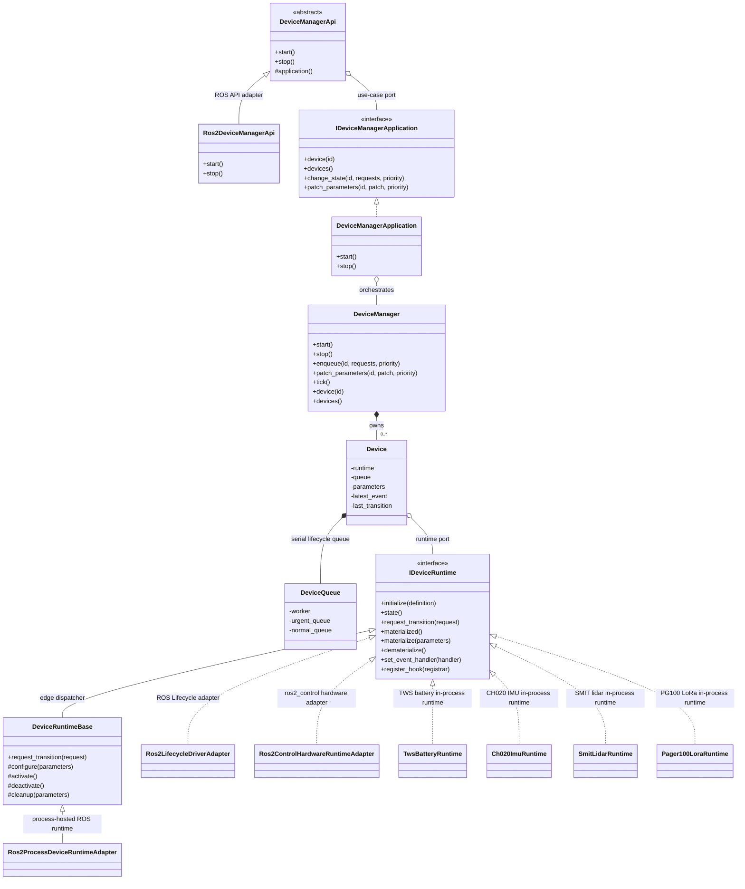
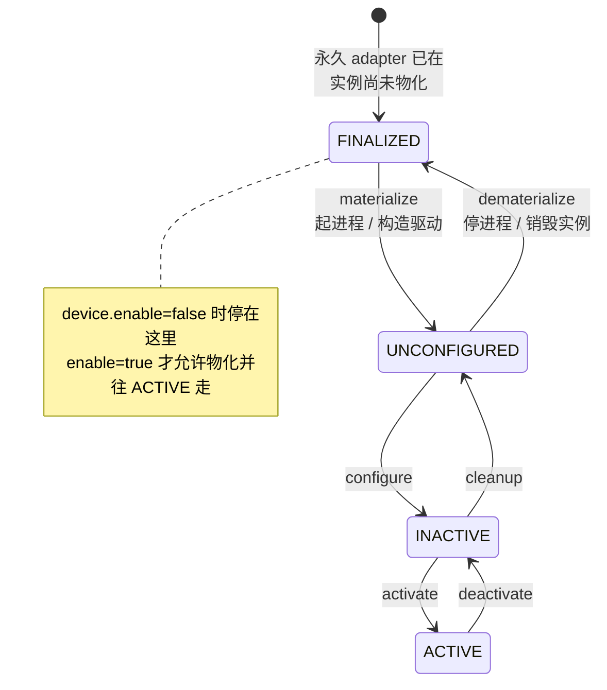
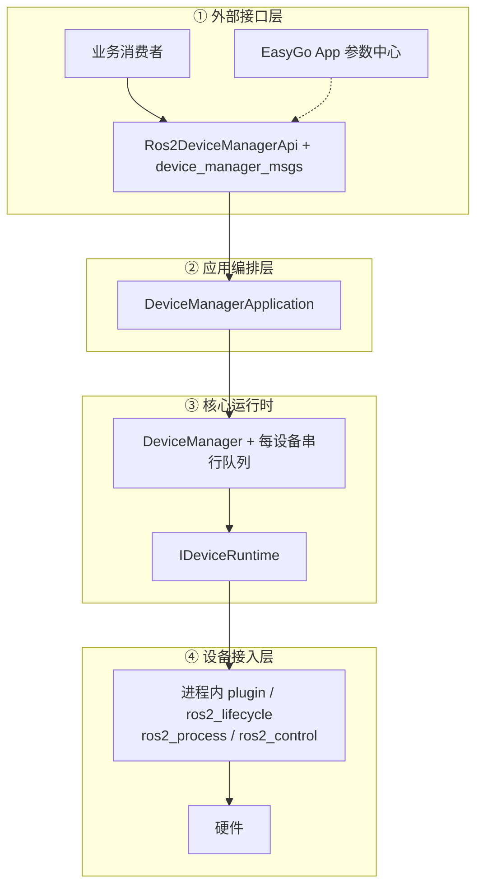

最近新项目的设备管理需求也渐渐迫在眉睫了，之前其他同事只是通过订阅一下各个硬件设备对应的topic/service应付一下。但这种方式毫无疑问是不可维护的。

其实最初来这家公司主要负责的就是各种驱动模块，但当时作为一个维护者的角色，平日间无非是修修补补，今天处理下超时；明天处理下重连，诸如此类，烦不胜烦。

但重复的工作在让我厌烦的同时，也在无形中让我对“设备管理”有了更深的理解。

我认为是否对一类业务有理解意味着要对需求的这些方面有清晰的认识：

1. 想要解决的问题是什么？

2. 如何解决才能更抽象更一致地应对此类问题的各种实际场景？

所谓经验，无非是更清晰的理解问题是什么，并且在已有方案受到新场景挑战的时候，迭代出新的方案。在此洗礼之下，你不断前进就是在不断获得经验。

言归正传，所以设备管理想要解决的问题是什么呢？其实就是一台AMR这么多设备，怎么观测？怎么控制？怎么和其他功能业务互相影响？而实际场景就是不同设备使用不同驱动，其输入输出和依赖都不尽相同。比如说下层连接可能是串口，可能是网口，输出可能是图片，也可能是雷达数据。

# 原方案

原项目有不少做的好的地方，比方说各种雷达渐渐都使用了一致的生命周期管理逻辑，下层也衍生了通用的tcp/udp/serial通信基础设施，与其他业务之间的联系在保证无直接耦合的基础上也工作的不错。

但是缺点也很明显。

1. 所有相机做了一套生命周期管理，所有雷达又有一套生命周期管理，还有一些设备比如IMU甚至是单独模块。

2. 具备可观测性和重连能力，但是不具备可控制性

3. 无法应对多进程的场景

# 新方案

取长补短的情况下，新的设备管理模块要求具备如下能力：

1. 支持多进程/多线程

2. 统一生命周期管理

3. 可观测，可控制

4. 可自动重连

## 类图

## 状态图

状态定义主要借鉴了ros2 life cycle，但是与其最大的差异在于我这里没有真正的终态，finalized也是可以继续流转的。

# 系统分层

## 核心

整个系统的核心突出的是设备管理，所以并不涵盖任何设备驱动的细节（不同设备有不同驱动，有时甚至无法得知源码，这就是事实）。它旨在定义清晰的接口，对上提供观测和控制能力，对下控制设备和获取设备状态。通过hook实现自动重连，通过状态上报实现观测，通过外部控制消息实现生命周期控制。

因为是通过接口消息关联下层具体驱动，所以既可以支持单进程，实现回调即可；也可以支持多进程，添加实现回调的adapter并在adapter中与真正的驱动进程实现进程间通信。

**不论是hook还是下层状态消息亦或是上层控制消息都可能触发生命周期控制原语，最终是入队列，控一个设备，没有多线程问题。**在满足设备可观测、可控制的基础上，顺带实现了自动重连。

## 下一步\(optional\)

随着下层驱动实现类越来越多，后续可以考虑统一下层通信基础设施和其他基础设施，以进一步提高代码质量和可维护性。

# 结语

识别常改变、无法要求不改变的模块，将其下放到系统边缘去具体实现，这些边缘的具体类负责处理问题细节，但也能抽象出一个个基类/接口，编排规划这些接口就是所谓的框架。

GitHub链接——https://github.com/Crazyokd/device-manager
