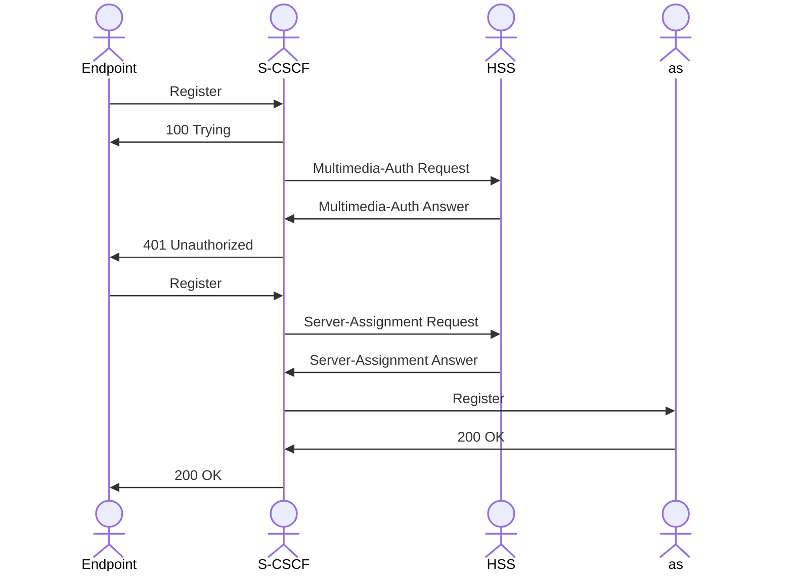

在上篇中我们对SIP有了一个全面的认识，现在让我们来重点看看SIP注册。

流程示例：

```txt
                  biloxi.com         Bob's
                   registrar       softphone
                      |                |
                      |   REGISTER F1  |
                      |<---------------|
                      |    200 OK F2   |
                      |--------------->|
```

请求示例：

```txt
       REGISTER sip:registrar.biloxi.com SIP/2.0
       Via: SIP/2.0/UDP bobspc.biloxi.com:5060;branch=z9hG4bKnashds7
       Max-Forwards: 70
       To: Bob <sip:bob@biloxi.com>
       From: Bob <sip:bob@biloxi.com>;tag=456248
       Call-ID: 843817637684230@998sdasdh09
       CSeq: 1826 REGISTER
       Contact: <sip:bob@192.0.2.4>
       Expires: 7200
       Content-Length: 0
```

响应示例：

```txt
        SIP/2.0 200 OK
        Via: SIP/2.0/UDP bobspc.biloxi.com:5060;branch=z9hG4bKnashds7
         ;received=192.0.2.4
        To: Bob <sip:bob@biloxi.com>;tag=2493k59kd
        From: Bob <sip:bob@biloxi.com>;tag=456248
        Call-ID: 843817637684230@998sdasdh09
        CSeq: 1826 REGISTER
        Contact: <sip:bob@192.0.2.4>
        Expires: 7200
        Content-Length: 0
```

注册是biloxi.com服务器了解Bob当前位置的一种方式。初始化后，Bob的SIP电话会定期向biloxi.com域中的SIP registrar发送注册消息。

注册消息关联Bob的SIP或SIPS URI（SIP:bob@biloxi.com)和他当前登录的机器（在Contact header字段中作为SIP或SIPS URI传送）。

registrar将此关联（也称为绑定）写入一个称为位置服务的数据库，该数据库可供biloxi.com域中的代理使用。

# IMS中的SIP注册



‍

**这个过程确保了用户终端 (UA) 在网络中可以被找到（注册），并且网络确认了用户的身份（认证），允许其使用服务。**

* **注册 (Registration):**  用户终端向 SIP 注册服务器报告其当前的可达地址（Contact URI），以便其他用户可以通过用户的 SIP 地址（公共用户标识）找到它并建立会话。注册建立了用户标识（例如 SIP URI）与设备地址（Contact URI）之间的绑定关系。
* **认证 (Authentication):**  SIP 服务器验证用户终端的身份，确认其有权在网络中注册和使用服务。这通常基于用户名和密码，但密码本身不会在网络中明文传输。

## SIP 注册认证过程（基于 Digest 认证）：

**第一步：用户终端 (UA) 发送未认证的 REGISTER 请求**

* 用户终端启动或连接到网络后，会尝试向其配置的 SIP 注册服务器（通常是通过 P-CSCF 找到的归属网络的 S-CSCF）发送第一个 REGISTER 请求。
* 这个请求包含了用户的身份信息和希望注册的联系地址：

  * **REGISTER sip:domain.com SIP/2.0**
  * **To:**  `sip:user@domain.com`​ (用户的公共用户标识，指示谁在注册)
  * **From:**  `sip:user@domain.com`​ (通常与 To 相同，标识发起请求的用户)
  * **Contact:**  `[sip:ua_ip:ua_port;transport=udp](sip:ua_ip:ua_port;transport=udp)`​ (用户终端当前的可达地址)
  * **Expires:**  `3600`​ (希望的注册有效期，单位秒)
  * 还包含 Via, Call-ID, CSeq 等其他标准 SIP 头部。

**第二步：服务器发送 401/407 响应（质询 Challenge）**

* 注册服务器（Registrar，通常是 S-CSCF）收到未认证的 REGISTER 请求后，发现无法确定请求者的身份。
* 服务器会拒绝这个请求，并发送一个认证**质询**响应给用户终端。响应状态码通常是 `401 Unauthorized`​ (如果质询来自 Registrar/UA Server) 或 `407 Proxy Authentication Required`​ (如果质询来自代理服务器 P-CSCF)。
* 这个响应中包含了进行认证所需的参数，这些参数位于 `WWW-Authenticate` 头部（对应 401 响应）或 `Proxy-Authenticate`​ 头部（对应 407 响应）中：

  * **SIP/2.0 401 Unauthorized** (或 407 Proxy Authentication Required)
  * **WWW-Authenticate:**  `Digest realm="domain.com", algorithm=MD5, nonce="..."`

    * ​`realm`​: 认证的领域或范围。
    *  algorithm :
    * ​`nonce`​: 一个由服务器生成的、每次质询都不同的随机字符串，用于防止重放攻击。
  * 还包含 Via (原样返回), From, To, Call-ID, CSeq 等与原请求匹配的头部。


**第三步：用户终端计算响应并重发已认证的 REGISTER 请求**

* 用户终端收到 401/407 响应后，解析出 `WWW-Authenticate` 或 `Proxy-Authenticate` 头部中的认证参数（realm, nonce, opaque, qop 等）。
* 用户终端利用这些参数、用户名和密码等来计算一个**响应摘要 (response digest)** 。计算过程使用指定的哈希算法（如 MD5 或 SHA-256）
* 用户终端构建一个新的 REGISTER 请求，内容与第一次请求基本相同，但额外添加了 `Authorization` 头部（对应 401 质询）或 `Proxy-Authorization`​ 头部（对应 407 质询）。
* `Authorization` 或 `Proxy-Authorization` 头部包含了计算出的响应摘要以及计算过程中使用的参数：

  * **Authorization:**  `Digest username="user", realm="domain.com", nonce="...", uri="sip:domain.com", response="..."`​

    * ​`username`​: 用户名。
    * ​`realm`​: 从质询中获取的领域。
    * ​`nonce`​: 从质询中获取的随机字符串。
    * ​`uri`​: 用于计算 HA2 的 URI。
    * ​`response`​: 计算出的响应摘要。
* 用户终端将这个包含 `Authorization`​ 或 `Proxy-Authorization`​ 头的请求发送给服务器。


**第四步：服务器验证响应并发送 2xx OK 响应（成功）**

* 注册服务器收到带有 `Authorization`​ 或 `Proxy-Authorization`​ 头的 REGISTER 请求。
* 服务器解析出头部中的所有参数，特别是 `response`​ 值。
* 服务器根据请求中的信息、之前发送的质询参数（nonce等）以及从其用户数据库（如 HSS）中获取的用户**密码**，使用与用户终端相同的算法**独立计算**一个响应摘要。
* 服务器比较自己计算出的响应摘要与用户终端在 `Authorization`​ 头部中提供的 `response`​ 值。
* **如果两者匹配**，则认证成功。服务器确认用户的身份有效，并执行注册操作（更新位置绑定信息）。然后服务器发送一个 2xx 成功响应（最常见是 200 OK）给用户终端，表示注册成功。200 OK 响应的 Contact 头部会包含用户注册的 Contact URI 和服务器接受的有效期。

  * **SIP/2.0 200 OK**
  * **To:**  `sip:user@domain.com;tag=...`​ (包含服务器生成的 tag)
  * **From:**  `sip:user@domain.com;tag=...`​ (包含用户终端生成的 tag)
  * **Contact:**  `[sip:ua_ip:ua_port;transport=udp](sip:ua_ip:ua_port;transport=udp);expires=3600`​ (服务器确认的注册信息和有效期)
* **如果两者不匹配**，则认证失败。服务器可能会再次发送一个 401/407 质询，或者发送其他错误响应（如 403 Forbidden）。

> **注册刷新和去注册也都是需要认证的**
