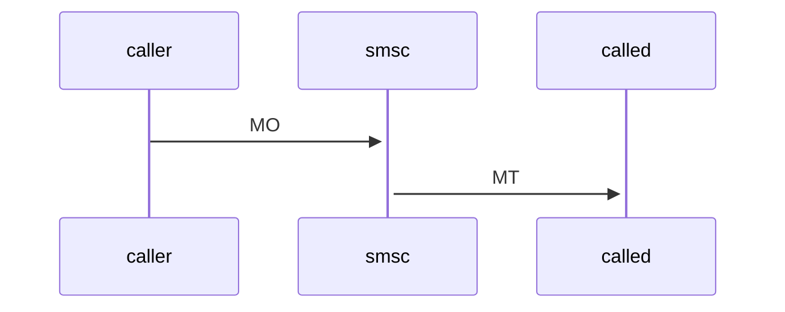
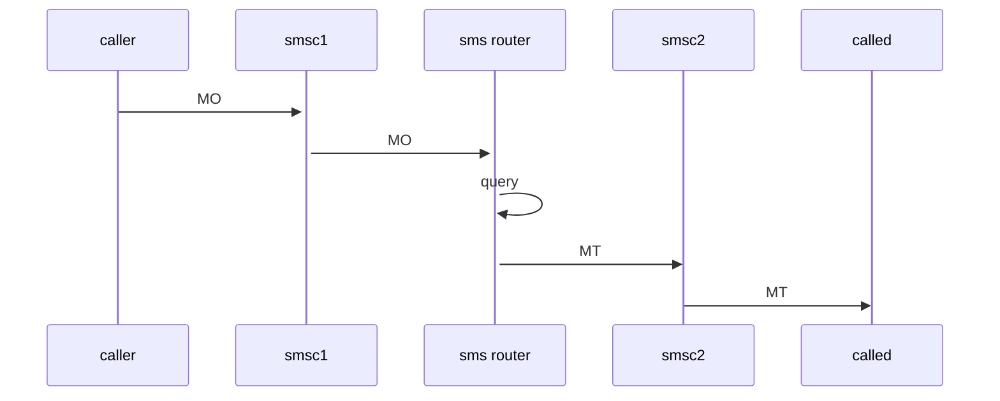
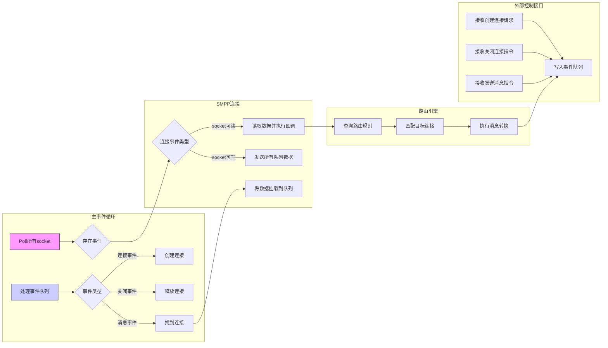
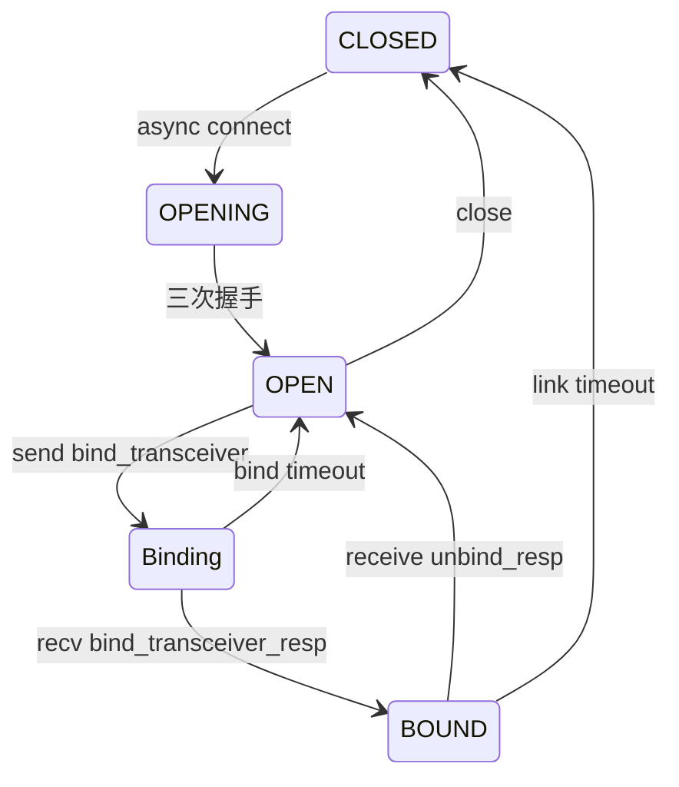

smpp全称为Short Message Peer-to-Peer，即短消息点对点协议。

该协议主要用于实现应用程序和手机之间的短信通信。

短信的交付基本上还是得依赖SMSC的MT。但在此之前的发送和路由过程却极大的丰富了。

常规的短信过程类似于：

这个过程可以进一步丰富：

我过去实现的NAS短信就符合上述过程。

那么既然可以通过MO/MT进行短信提交和交付，而MO/MT又可以基于不同的应用协议，如S1AP-NAS/SIP/Diameter/Radius等，为什么还需要SMPP呢？

我认为这其中的最大原因正是“应用协议”，上面提到的多种应用协议其实都是相对复杂的，基于它们只是一种“顺便”的妥协。核心网中的网元欲发挥其职能作用，势必已经支持了其中的一种或多种协议。这时候，再支持短信也无非是在协议规范上加上一个新的子消息类型而已，毕竟短信结构已有其对应规范。

但对于第三方应用则不同，为了支持简单的收发短信甚至需要支持一整个Diameter或Sip，虽然可以选择仅实现所需的最小子集，但这反而使得几乎没有摊销成本，也就更不划算了。

所以**专为短信**设计一款**轻量**的应用协议也就不足为怪了。

这时，第三方应用若想支持短信能力，仅需实现SMPP，而涉及的核心网网元再增加一个SMPP协议支持也不会显得负担过大。

# 角色

市面上对[SMPP v3.4](https://smpp.org/SMPP_v3_4_Issue1_2.pdf)的开源实现尤其多，故下文也是基于此版本进行设计和开发。

SMPP协议中详细的描述了两种角色，即ESME(Extern Short Message Entity)和SMSC，包括二者的能力和职责。

SMPP支持三种会话，分别为：

* **Transmitter** (**TX**)：ESME只能发送不能接收
* **Receiver** (**RX**)：ESME只能接收不能发送
* **Transceiver** (**TRX**)：ESME既可发送也能接收

上面讲的接收和发送只是大体笼统而言，对于各种会话下支持的完整消息类型请参考*协议 2.3 SMPP PDUs*.

会话选择由ESME发起，如Bind Transceiver，而SMSC侧以Bind_xxx_Resp回复接受或拒绝。还存在一种名为Outbind的特殊情况，即SMSC侧主动通知ESME发起**Bind_Receiver。**

# 目标

我的目标是设计一款**ESME**，其重点具备如下能力：

* 支持同时连接多个SMSC，并实现自动重连和状态机维护
* 支持灵活的路由能力，当收到来自某个SMSC的请求后，能够通过加载的路由方案进行适当转换后路由出去
* 支持外部接口控制，包括创建连接/关闭连接/发送消息

# 设计

绑定会话类型后即框定了能力和职责，为了更好的贴合我的目标，我自然要做出一些取舍。

所以我仅支持Bind_Transceiver，不支持Outbind，也不支持服务监听，仅支持主动连接。

总体功能架构如下：

不难发现，系统的几乎所有业务都是基于网络的，为了SMPP连接的一致性管理并保证线程安全，我采用了全异步poll。

即单线程轮询所有socket并对事件执行回调处理，当然主事件循环还包括消费来自外部接口的事件，如创建连接事件/关闭连接事件/发送消息事件等。

下面是一个简化版的流程图（可惜Mermaid不支持泳道图）：

# 定时器

协议推荐实现四种定时器，每一种都应该是可配置的：

* session_init_timer：由smsc实现，决定连接建立后，等待esme发送bind的最长时间。超时即断链
* enquire_link_timer：双方均需实现，该定时器指定操作之间允许的间隔时间，在此间隔时间之后，SMPP实体应该询问其对等体是否仍有活动会话。
* inactivity_timer：双方均需实现，事务会话过期时间，**超时则丢弃SMPP会话**。
* response_timer：双方均需实现，发起SMPP请求的实体可以假设请求尚未被处理，并且应该针对特定的SMPP操作采取适当的操作。

**作为esme简单起见，主要实现enquery_link_timer和response_timer，即不活跃一定时间后发送enquery_link，响应超时后触发默认错误处理（丢弃smpp会话）。**

一个简化版的状态图如下：

# 参考链接

* [SMPP官方网站](https://smpp.org/)
* [SMPP v3.4](https://smpp.org/SMPP_v3_4_Issue1_2.pdf)
* [libsmpp34](https://github.com/osmocom/libsmpp34)
* [smpp-smsc-sumulator](https://github.com/melroselabs/smpp-smsc-simulator)
