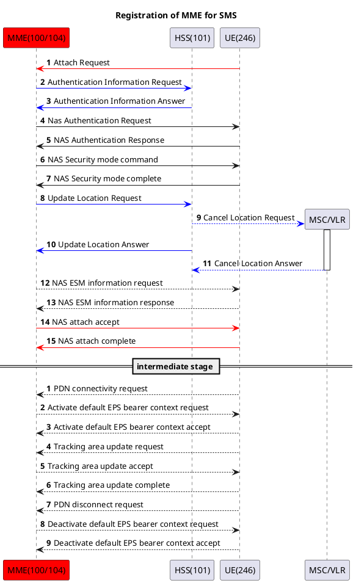
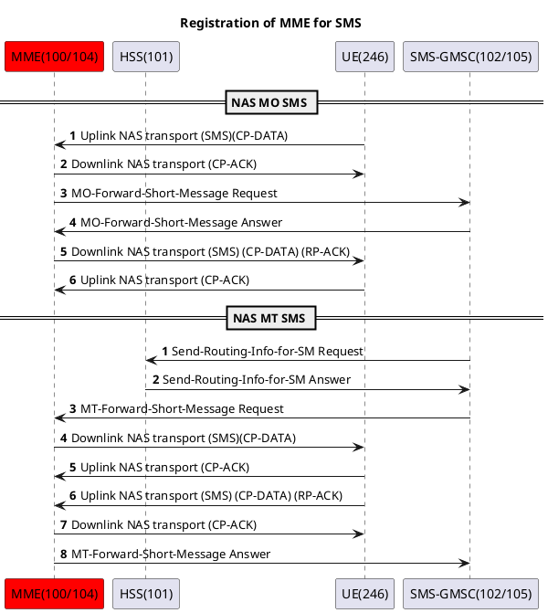
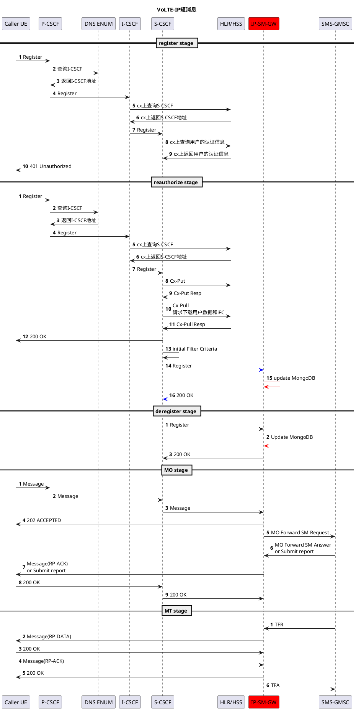

# 引言

想写这篇文章很久了，但是苦于材料分散以及自身原因，直到现在才得以动笔。

开始做这个的时间节点大约是23年10月底11月初，到了24年一月份就已基本实现，但交付前被其他任务打断，故24年6月才正式完成交付。

刚开始做的时候对我来说难点非常多，主要是因为通信小白的背景和编程基础薄弱（而代码库都是大师的作品）。

但是那段时间白天上班不停的翻阅3GPP标准文档，恶补通信基础知识；晚上回家后又继续阅读编程书籍，补足编程基础。

由于这两大难点都在被我慢慢瓦解，所以做到后面颇有一番渐入佳境的感慨。

当然，通过这番经历，24年的后续项目也变得得心应手，颇为顺利。

# 介绍

4G中短信业务基本都是由IMS网络负责的。

在IMS中短信AS（在我们这套系统中取名为smsc）负责短信业务处理，链路传输使用UDP/SIP。

‍

在没有IMS网络的情况下，也可以将语音业务fallback到3G中进行。MME网元可通过连接3G的SGSAP网元实现各种CS业务。

‍

那么什么是nas短信呢？

在没有IMS网络的情况下，手机短信会通过SCTP/S1AP上行至MME，此时短信相关的所有信息都放在S1AP/NAS包中，故又称为NAS短信。

而这次我们要做的是`SMS in MME`​，即当nas短信上行来的时候，我们不走SGSAP，而是直接通过EPC实现短信业务。

‍

# SMS-in-MME

这种方案非常小众，实际情况中基本还是采用IMS/SGSAP。其具体规范主要定义在23.272的附录C中。下面是具体的几个交互图：

1. mme向hss注册SMS-in-MME能力：

    为s6a/ulr添加supported-features，该AVP首次定义于29.229

    为s6a/ulr添加MME-Number-for-MT-SMS，OctetString

    为s6a/ulr添加SMS-Register-Request，Enumerated

2. EPC中的短信交互：

‍

为了实现上述交互，我们需要：

1. 升级s6a/ulr从而使MME可向HSS注册自己的SMS-in-MME能力。
2. 新增SGd和S6c，分别在MME上实现SGd，在HSS上实现S6c，在SMS-GMSC上实现SGd和S6c。
3. 修改MME对于NAS短信的处理逻辑。

‍

因为上述修改几乎都是在EPC上进行，故读懂源码后就可以动手开干了！

---

# SMS-in-MME融合IP-SM-GW

完成上述功能以后，接下来的任务是将SMS-in-MME与正常IMS网络中的短信业务相融合。

‍

原先的IMS代码库中存在一个SMSC网元充当短信AS。

其处理逻辑大致如下：

1. UEA发送SIP MESSAGE
2. SMSC收到短信后立刻回送202 Accept。
3. 将短信存储到MySQL
4. 异步定时器定时从MySQL中读取短信数据并下发到UEB
5. UEB收到短信后回送rp-ack
6. SMSC收到ack后回送200 OK

‍

接下来我们修改上述流程，我们需要：

1. 将SMSC改为IP-SM-GW，由EPC中的SMS-GMSC网元统一完成短信的存储/下发。
2. 通过配置iFc使得S-CSCF不论是Register还是Message都转发到IP-SM-GW。
3. 使IP-SM-GW支持SGd（至少包括发送OFR/TFA和接收TFR/OFA）
4. 统一数据库为MongoDB。
5. 当IP-SM-GW收到Register消息时，相应的更新MongoDB中的在线状态；当收到Message消息时，发送OFR到EPC中的SMS-GMSC。

具体交互图如下

# 架构

​​

# 后记

一开始被给到该需求的时候，并没有这么清晰的方案设计（反而脑子里只是一团糨糊）。

后续各种翻阅标准文档，才对实现方案有了越来越清晰的认识。但设计是一回事，实现又是另一回事，尤其是在已经有了好几套成熟的代码库的前提下。所以很多决策更改主要是依据可行性和难易度。

‍

# 参考

29.329："Sh Interface based on the Diameter protocol".

29.338：sgd/s6c

23.272：SMS-in-MME

23.204

24.301：nas in epc

23.040

‍
