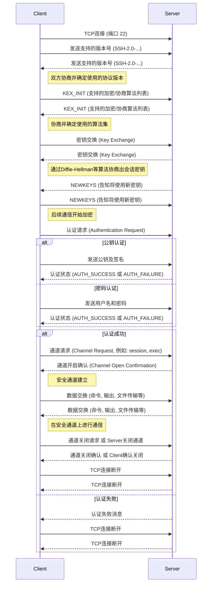

最初，网络主机之间的通信是不加密的，属于明文通信。这使得通信变得很不安全，一个典型的例子就是服务器登录。登录远程服务器的时候，需要将用户输入的密码传给服务器，如果这个过程是明文通信，就意味着传递过程中，线路经过的中间计算机都能看到密码，这是很危险的。

SSH 就是为了解决这个问题而诞生的，它能够加密计算机之间的通信，保证不被窃听或篡改。它还能对操作者进行认证（authentication）和授权（authorization）。明文的网络协议可以套用在它里面，从而实现加密。

# What
SSH（Secure Shell）是一种网络协议，用于加密两台计算机之间的通信，并且支持各种身份验证机制。

实际业务中，它主要用来保证远程登录和远程通信的安全，任何网络服务都可以用这个协议来加密。

SSH 的软件架构是服务器-客户端模式（Server - Client）。在这个架构中，SSH 软件分成两个部分：向服务器发出请求的客户端（client），OpenSSH 的实现为 ssh；接收客户端发出的请求的服务器（server），OpenSSH 的实现为 sshd。

另外，OpenSSH 还提供一些辅助工具软件（比如 ssh-keygen 、ssh-agent）和专门的客户端工具（比如 scp 和 sftp）。

# History
1995年，芬兰赫尔辛基工业大学的研究员 Tatu Ylönen 设计了 SSH 协议的第一个版本（现称为 SSH 1），同时写出了第一个实现。

当时，他所在的大学网络一直发生密码嗅探攻击，他不得不为服务器设计一个更安全的登录方式。写完以后，他就把这个工具公开了，允许其他人免费使用。

SSH 可以替换 rlogin、TELNET、FTP 和 rsh 这些不安全的协议，所以大受欢迎，用户快速增长，1995年底已经发展到五十个国家的20,000个用户。SSH 1 协议也变成 IETF 的标准文档。

1995年12月，由于客服需求越来越大，Tatu Ylönen 就成立了一家公司 SCS，专门销售和开发 SSH。这个软件的后续版本，逐渐从免费软件变成了专有的商业软件。

SSH 1 协议存在一些安全漏洞，所以1996年又提出了 SSH 2 协议（或者称为 SSH 2.0）。这个协议与1.0版不兼容，在1997年进行了标准化，1998年推出了软件实现 SSH2。但是，官方的 SSH2 软件是一个专有软件，不能免费使用，而且 SSH1 的有些功能也没有提供。

1999年，OpenBSD 的开发人员决定写一个 SSH 2 协议的开源实现，这就是 OpenSSH 项目。该项目最初是基于 SSH 1.2.12 版本，那是当时 SSH1 最后一个开源版本。但是，OpenSSH 很快就完全摆脱了原始的官方代码，在许多开发者的参与下，按照自己的路线发展。OpenSSH 随 OpenBSD 2.6 版本一起提供，以后又移植到其他操作系统，成为最流行的 SSH 实现。目前，Linux 的所有发行版几乎都自带 OpenSSH。OpenSSH 的客户端是二进制程序 ssh。

现在，SSH-2 有多种实现，既有免费的，也有收费的。

# SSH 登录
## 流程步骤
0. 客户端通过`ssh-keygen`生成自己的公钥和私钥，并手动将公钥放入远程服务器的指定位置。

1. 客户端向服务器发起 SSH 登录的请求。

2. 服务器收到用户 SSH 登录的请求，发送一些随机数据给用户，要求用户证明自己的身份。

3. 客户端收到服务器发来的数据，使用私钥对数据进行签名，然后再发还给服务器。

4. 服务器收到客户端发来的加密签名后，使用对应的公钥解密，然后跟原始数据比较。如果一致，就允许用户登录。

## 网络交互


## 实际操作
### 生成密钥
```bash
ssh-keygen
```

### 上传公钥
OpenSSH 规定，用户公钥保存在服务器的`~/.ssh/authorized_keys`文件。只要把公钥添加到这个文件之中，就相当于公钥上传到服务器了。每个公钥占据一行。如果该文件不存在，可以手动创建。

每一行的基本构成(和.pub公钥文件一致)通常是以下几个部分，按顺序排列，用空格或制表符分隔：

+------------------------------------------+
**[选项] 公钥类型 公钥字符串 [注释]**
+------------------------------------------+

#### 详细解释

- 选项 (Options):

它是一系列用逗号分隔的选项，用于限制这个公钥的使用方式。 如果有多个选项，它们之间用逗号 , 分隔。 常见的选项包括：

| 选项                             | 描述                                                                                                                               |
| :------------------------------- | :--------------------------------------------------------------------------------------------------------------------------------- |
| `command="/path/to/script"`      | 当使用这个公钥登录时，不执行用户指定的 shell 或命令，而是强制执行指定的脚本。常用于限制特定用户只能执行特定操作。                                   |
| `from="pattern"`                 | 限制只有从匹配指定网络地址模式的主机才能使用此公钥登录。例如 `from=".example.com,192.168.1."`。                                                |
| `no-pty`                         | 禁用此公钥的伪终端分配（即不能获得交互式 shell）。                                                                                 |
| `restrict`                       | 一个方便的选项，相当于同时启用了 `no-port-forwarding`, `no-pty`, `no-agent-forwarding`, `no-X11-forwarding`。可以再配合 `command` 或 `from` 使用。 |

- 公钥类型 (Public Key Type):

指定了公钥使用的加密算法类型。

| 公钥类型             | 描述                                                        |
| :------------------- | :---------------------------------------------------------- |
| `ssh-rsa`            | RSA 算法（较常见，但安全性推荐使用更新的算法）。            |
| `ssh-dss`            | DSA 算法（较少用，安全性不如 RSA）。                        |
| `ecdsa-sha2-nistp256`| 基于 SHA256 散列函数的 NIST P-256 曲线的 ECDSA 算法。     |
| `ecdsa-sha2-nistp384`| 基于 SHA384 散列函数的 NIST P-384 曲线的 ECDSA 算法。     |
| `ecdsa-sha2-nistp521`| 基于 SHA512 散列函数的 NIST P-521 曲线的 ECDSA 算法。     |
| `ssh-ed25519`        | Ed25519 算法（目前推荐使用的算法之一，速度快，安全性好）。 |

- 公钥字符串 (Public Key String):

这是公钥的核心内容，是一个很长的、Base64 编码的字符串。 这个字符串是由生成公钥时产生的密钥数据经过编码得来的。

- 注释 (Comment):

通常是用来标识这个公钥属于谁或者从哪里来的，比如生成密钥时的用户名和主机名（例如 user@hostname）。
SSH 服务器在进行认证时不会使用这个注释信息，它仅仅是为了方便管理员识别不同的公钥。
当你使用 ssh-keygen 生成公钥时，生成的 .pub 文件最后通常就包含这个注释。

#### 实例
下面的示例表示，当使用这个 Ed25519 公钥登录时，只允许执行 /usr/local/bin/backup.sh 脚本，并且禁用了端口转发功能，最后是该密钥的注释：

`command="/usr/local/bin/backup.sh",no-port-forwarding ssh-ed25519 AAAAC3NzaC1lZDI1NTE5AAAAID...kOQ= backup_system_key`

#### ssh-copy-id
OpenSSH 自带一个`ssh-copy-id`命令，可以自动将公钥拷贝到远程服务器的`~/.ssh/authorized_keys`文件。如果`~/.ssh/authorized_keys`文件不存在，`ssh-copy-id`命令会自动创建该文件。
```bash
ssh-copy-id -i key_file user@desthost
```

> 如果没有该命令比如Windows上，可以上传公钥后，执行`cat xxx.pub >> authorized_keys`

### 登录服务器
```bash
ssh user@hostname
```
> ssh 连接远程服务器后，首先会有一个验证过程，验证远程服务器是否为陌生地址。
> 
> 如果是第一次连接某一台服务器，命令行会显示一段文字，表示不认识这台机器，提醒用户确认是否继续连接。

# 配置文件
SSH 客户端的全局配置文件是`/etc/ssh/ssh_config`。用户个人的配置文件是`~/.ssh/config`，优先级高于全局配置文件。

用户个人的配置文件可以按照不同服务器，列出各自的连接参数，从而不必每一次登录都输入重复的参数。下面是一个例子。

```plain
Host *
     Port 2222

Host remoteserver
     HostName remote.example.com
     User neo
     Port 2112
     IdentityFile ~/.ssh/id_rsa # 配合IdentitiesOnly同时使用，表示仅使用指定的认证文件进行验证，默认会将所有可用的身份验证标识（如私钥）提供给服务器进行尝试。
     IdentitiesOnly yes
```

上面代码中，`Host *`表示对所有主机生效，后面的`Port 2222`表示所有主机的默认连接端口都是2222，这样就不用在登录时特别指定端口了。
> _这里的缩进并不是必需的，只是为了视觉上，易于识别针对不同主机的设置。_

后面的`Host remoteserver`表示，下面的设置只对主机`remoteserver`生效。`remoteserver`只是一个别名，具体的主机由`HostName`命令指定，`User`和`Port`这两项分别表示用户名和端口。这里的`Port`会覆盖上面`Host *`部分的`Port`设置。

以后，登录`remote.example.com`时，只要执行`ssh remoteserver`命令，就会自动套用 config 文件里面指定的参数。

> `Host`命令的值可以使用通配符，比如`Host *`表示对所有主机都有效，`Host *.edu`表示只对一级域名为`.edu`的主机有效。它们的设置都可以被单个主机的设置覆盖。

ssh 客户端配置文件的每一行，就是一个配置命令。配置命令与对应的值之间，可以使用空格，也可以使用等号。

```plain
Compression yes
# 等同于
Compression = yes
```

> _`#`开头的行表示注释。_

ssh 客户端的完整配置命令请参考 `man ssh`命令。

# 服务器指纹

所谓“服务器指纹”，指的是 SSH 服务器公钥的哈希值。每台 SSH 服务器都有唯一一对密钥，用于跟客户端通信，其中公钥的哈希值就可以用来识别服务器。

ssh 会将本机连接过的所有服务器公钥的指纹，都存储在本机的`~/.ssh/known_hosts`文件中。每次连接服务器时，通过该文件判断是否为陌生主机（陌生公钥）

# 参考
- [https://wangdoc.com/ssh/](https://wangdoc.com/ssh/)
- [https://zhuanlan.zhihu.com/p/5942435947](https://zhuanlan.zhihu.com/p/5942435947)
